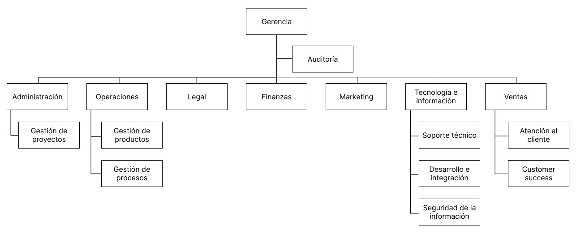

# Organigrama

## Gerencia

Es el departamento de la empresa encargado de tomar las decisiones ejecutivas, administrar el negocio y representar a la empresa frente a la mesa de inversores. Su principal representante es el CEO

## Auditoría

El equipo de auditoría interna se encuentra por encima del resto de departamentos, y se encarga de verificar tanto a nivel financiero como técnico que se cumplan todos los requerimientos y reglamentos planteados por la organización.

## Administración

Departamento encargado de dirigir los proyectos internos de la empresa. Coordinan el funcionamiento de las demás áreas, de manera que todas sigan los objetivos planteados. 

### Gestión de proyectos

Área dedicada a administrar los distintos proyectos tanto internos como externos de la empresa

## Operaciones

Este departamento se encarga de administrar las decisiones a nivel de producto, tales como la creación de ofertas o promociones. También se encargan los procesos que involucran al desarrollo de la cartera de productos de la empresa. 

### Gestión de producto

Área dedicada a la toma de decisiones con respecto al producto. Puede proponer mejoras, ampliar la cartera de productos, crear promociones, etc.

### Gestión de operaciones

Área dedicada a gestionar las diferentes operaciones relacionadas al producto y a mejorar la efectividad y eficiencias de las mismas.

## Legal

Departamento encargado de las directivas legales, que vigila el cumplimiento de la ley local y la relacionada a los productos o software que la empresa ofrece.

## Finanzas

Departamento encargado de la administración y manejo de los estados financieros, cuentas bancarias y pago a los colaboradores u otras empresas que ofrecen servicios a la organización

## Marketing

Departamento que se encarga de la promoción hacia el público de los productos ofrecidos por la organización

## Tecnonlogía e información

Departamento encargado de la administración de todos los aspectos tecnológicos de la empresa, además del e integración de nuevos productos computacionales, el cual es el enfoque de la empresa.

### Soporte técnico

Área dedicada a solucionar problemas técnicos que puedan presentar los clientes con respecto a los diferentes productos de la empresa.

### Desarrollo e integración

Área encargada de desarrollar los diferentes productos-software de la empresa. También acopla nuevas funcionalidades pensadas por otras áreas para los productos existentes.

### Redes

Área encargada de la administración del uso y configuración de las diferentes redes internas de conectividad presentes en la empresa, asi como la aseguración de la conexión hacia entidades exteriores.

### Seguridad informática

Área dedicada a proteger los archivos y equipos de la empresa, así como la información sensible de los colaboradores, clientes y usuarios. Protegen a la empresa frente a posibles ataques informáticos. 

## Ventas

Departamento dedicado a concretar la adquisición de los productos, asi como guiar a los clientes y potenciales clientes sobre la cartera que ofrece la empresa

### Atención al cliente

Área que se encarga de atender solicitudes y reclamos sobre características de los productos o fallas que puedan presentarse. Son el primer punto de contacto de soporte del cliente.

### Customer success

Área dedicada a analizar las tendencias de los clientes y generar posibles ideas de proyectos que ayuden a incrementar la cartera de clientes

[**Volver al índice**](../README.md)