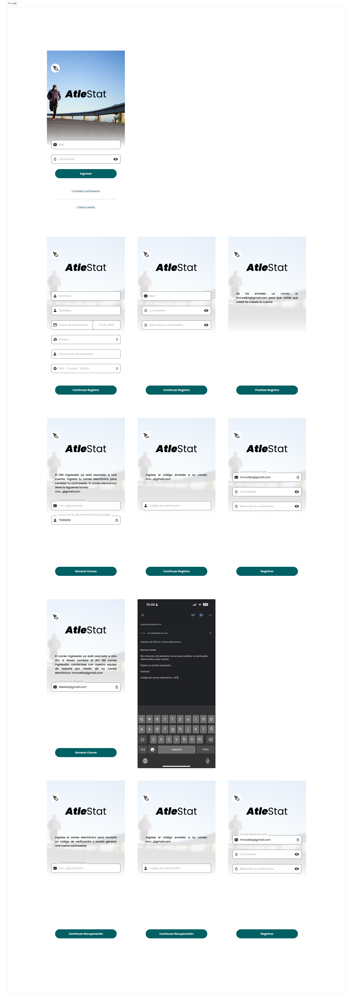
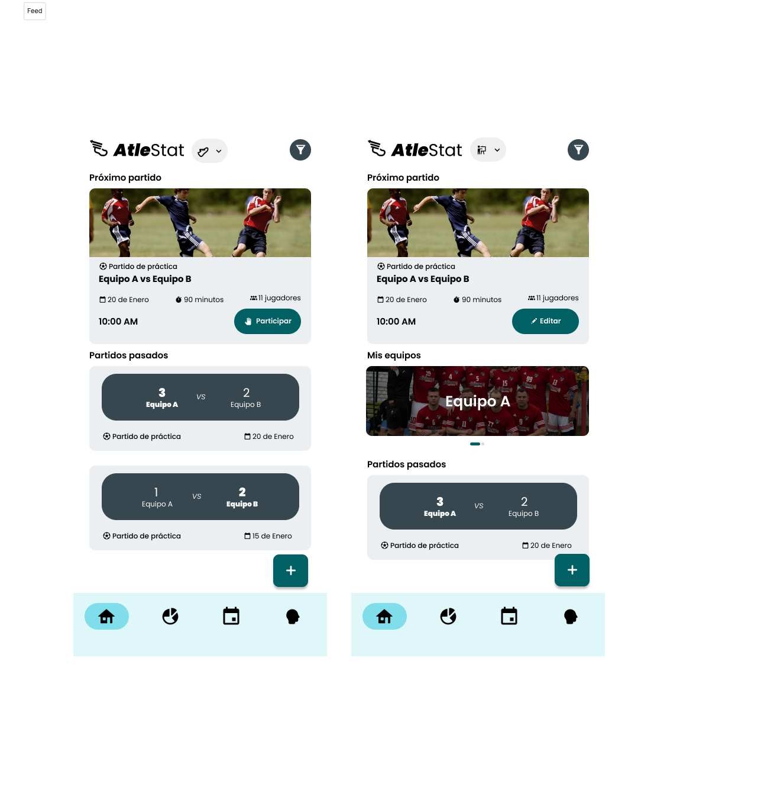
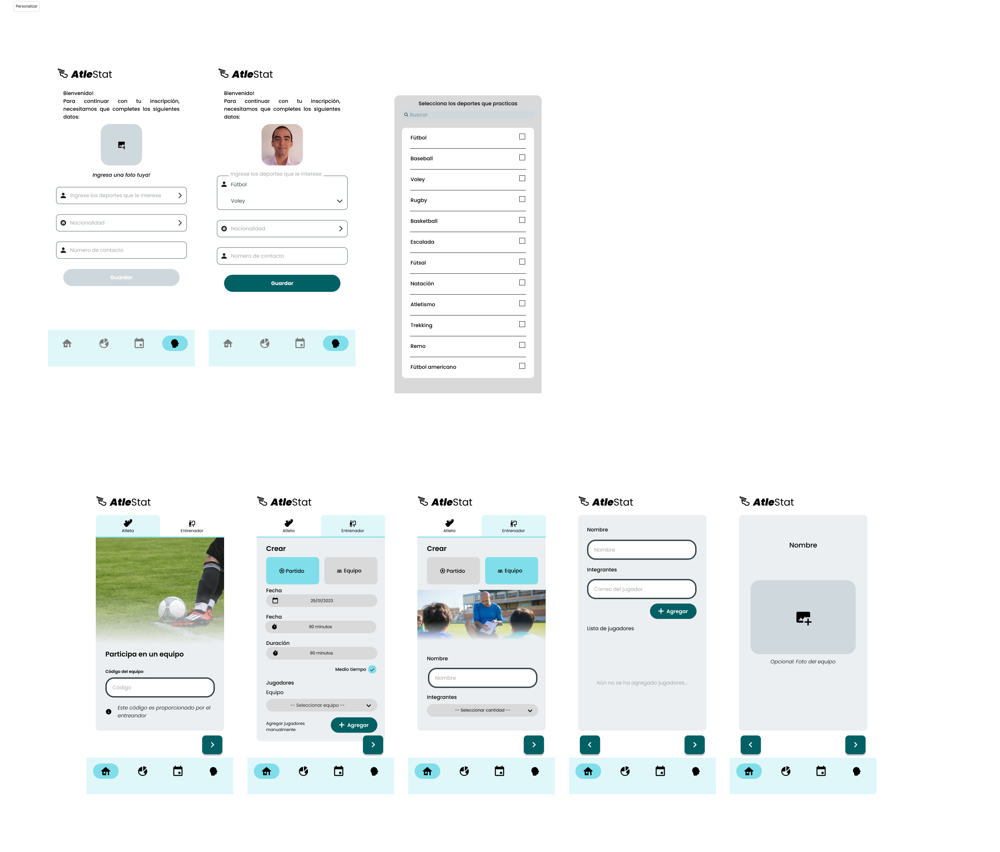

# Modulo 0: Acceso al sistema

## *Requerimientos funcionales*

### **1. Selección de tipo de usuario:**
- El cliente debe seleccionar el tipo de usuario que desea cumplir dentro del aplicativo
- En caso el tipo de usuario necesita un acceso especial deberá ingresar un código de invitación

### **2. Creación de acceso:** 
- En caso el usuario no exista, deberá ingresar sus credenciales de usuario
- En caso el usuario no exista, deberá ingresar un código de verificación
- En el usuario exista, se deberá colocar las credenciales existentes de acceso
- En caso el usuario no quiera generar un acceso con credenciales y quiere visualizar el app sin iniciar sesión o registrarse, el usuario puede ingresar al overview con funcionalidades limitadas 

## *Requerimientos no funcionales*

### ES00: Rendimiento:

- **Escenario:** Un cliente nuevo intenta registrarse en la aplicación por primera vez en un dispositivo móvil con una conexión a internet lenta.

- **Estímulo:** El cliente ingresa sus datos personales y crea una cuenta de usuario.

- **Fuente de estímulo:** La necesidad del cliente de acceder al sistema por primera vez.

- **Artefacto:** Aplicación Atlestats en un dispositivo móvil con conexión a internet lenta.

- **Respuesta:** La aplicación debe optimizar el proceso de registro para minimizar el tiempo de espera y la cantidad de datos transferidos, incluso en dispositivos con conectividad limitada. La aplicación debe mostrar indicadores de progreso y evitar bloqueos o interrupciones durante el registro.

- **Medida de respuesta:** Tiempo de carga del formulario de registro, ausencia de retrasos o interrupciones durante el proceso de registro, y capacidad para funcionar correctamente con conexiones a internet lentas.

### ES02: Usabilidad:

- **Escenario:** Un usuario nuevo, que no está familiarizado con la aplicación, necesita iniciar sesión por primera vez. La interfaz no presenta un flujo estandarizado de inicio de sesión/registro. Además, no tiene una interfaz amigable al usuario. 

- **Estímulo:** El usuario ingresa su nombre de usuario y contraseña en la pantalla de inicio de sesión.

- **Fuente de estímulo:** La necesidad del usuario de acceder a su cuenta por primera vez.

- **Artefacto:** Pantalla de inicio de sesión de la aplicación Atlestats.

- **Respuesta:** La pantalla de inicio de sesión debe ser clara, intuitiva y fácil de usar, incluso para usuarios nuevos o con poca experiencia técnica. La aplicación debe proporcionar instrucciones claras, ayudas contextuales y la opción de recuperar la contraseña en caso de que el usuario la haya olvidado.

- **Medida de respuesta:** Tiempo que tarda el usuario en iniciar sesión por primera vez, facilidad de uso de la pantalla de inicio de sesión y satisfacción del usuario con la claridad y la organización de la interfaz.

### ES03: Seguridad:

- **Escenario:** Un usuario intenta iniciar sesión en su cuenta con una contraseña incorrecta en varias ocasiones. Esto genera que se notifique al usuario que se ha bloqueado el acceso de la cuenta por unos minutos o si es que se ha olvidado su cuenta. 

- **Estímulo:** El usuario ingresa una contraseña incorrecta repetidamente.

- **Fuente de estímulo:** Un posible intento de acceso no autorizado a la cuenta del usuario.

- **Artefacto:** Mecanismo de autenticación de usuario en la aplicación Atlestats.

- **Respuesta:** La aplicación debe implementar un mecanismo de autenticación seguro que bloquee la cuenta del usuario después de un número determinado de intentos fallidos de inicio de sesión. La aplicación debe notificar al usuario sobre el bloqueo de la cuenta y proporcionar instrucciones para desbloquearla.

- **Medida de respuesta:** Efectividad del mecanismo de autenticación para prevenir accesos no autorizados, tiempo que tarda el usuario en desbloquear su cuenta y facilidad del proceso de desbloqueo.

### ES04: Disponibilidad:

- **Escenario:** Un usuario ha comprado un nuevo celular y desea conocer el estado de su equipo a media noche, el celular es Android y no cuenta con ningún aplicativo. La aplicación no tiene credenciales guardadas y hubo un error en el servidor que en ese tiempo no permite adquirir el servicio de inicio de sesión/registro. 

- **Estímulo:** El usuario descarga la aplicación de AtleStat en Android y desea ingresar sesión poco después de media noche, el acceso al sistema falla en generar las credenciales posterior a la media noche 

- **Fuente de estímulo:** Un intento de ingreso de usuario realizado después de media noche en un aplicativo sin credenciales de usuario guardadas. 

- **Artefacto:** Mecanismo de autentificación 

- **Respuesta:** Incrementar la capacidad del servidor y solucionar potenciales errores con el sistema de credenciales. Potencialmente adquirir un servicio de base de datos más confiable

- **Medida de respuesta:** Cantidad de acceso al sistema fallidos

# Modulo 1: Feed del usuario

## *Requerimientos funcionales*

### **1. Enseñar partidos:** 
- El usuario podrá visualizar los partidos próximos en caso de que este afiliado a un equipo. Si es que este no esta vinculado a un equipo, este no podrá visualizar los partidos que se aproximan de su equipo.
- El usuario podrá visualizar los partidos pasados en caso de que este afiliado a un equipo. Si es que no esta vinculado a un equipo, este no podrá visualizar los partidos pasados del equipo. Si es que esta afiliado a un equipo y no tiene partidos aún o no participado en ninguno, no tendrá partidos pasados.  Los partidos pasados sirven como un historial de cómo se desempeño el usuario o el equipo del usuario.

### **2. Calendario de actividades:**
- El usuario podrá visualizar los partidos/entrenamientos/eventos relacionados al equipo vinculado dentro de un calendario de actividades. Este calendario anota estos eventos importantes y se vincula al detalle de la actividad.

### **3. Filtro de equipos:**
- El usuario podrá filtrar los partidos a partir de un filtro de equipos. Esto se debe a que el usuario puede ser un jugador o coach y este puede pertenecer a múltiples equipos, se desea que el usuario pueda visualizar lo que es de su interés. 

## *Requerimientos no funcionales*

### ES05: Respuesta

Se desea que el feed del usuario tenga una tiempo de respuesta que se ajuste a la necesidad del usuario. Dado que es un app deportiva, cuando el usuario ingresa al app desea tener información de su rendimiento o ver el desempeño del partido en vivo. Esta respuesta debe darse en menos de un par de segundos porque probablemente el usuario acceda al app en pleno partido o lo más cercano a la finalización del partido. 

- **Escenario:** El usuario visualiza el app pocos minutos posterior al partido de su equipo y desea acceder al partido en la parte de partidos pasados. El internet es lento por lo que la app tarda en generar una respuesta del servidor y se genera un time out. 

- **Estímulo:** El internet de su ubicación es lento por lo que el app tarda en actualizarse

- **Fuente de estímulo:** Internet de la ubicación del usuario

- **Artefacto:** Feed del usuario 

- **Respuesta:** El app muestra un aviso de que el internet es lento y no se ha podido proceder con la actualización. Solicita una recarga cuando el internet se establilice. Sin embargo, se muestran los partidos que se han guardado en memoria local para que pueda seguir explorando el app incluso sin internet.  

- **Medida de respuesta:** Tiempo de respuesta de recarga/ Tiempo total en el app

### ES06: Usabilidad 

La segmentación del feed debe tener un sentido lógico que el usuario puede adquirir la información de los partidos en un orden dependiendo de la relevancia de los eventos que esten ocurriendo. 

- **Escenario:** El usuario desea encontrar rápidamente el resultado del último partido de su equipo. Para esto se desea que en la interfaz se muestren los partidos en una sección específica en cierto orden.
  
- **Estímulo:** El usuario abre la sección "Partidos pasados" del feed.

- **Fuente de estímulo:** El deseo del usuario de encontrar el resultado del último partido.
  
- **Artefacto:** El feed del usuario de la aplicación Atlestats.

- **Respuesta:** La aplicación debe mostrar de manera prominente el último resultado del partido para el equipo del usuario, lo que facilita que lo encuentren sin tener que desplazarse por una larga lista de otros partidos.

- **Medida de respuesta:** Tiempo que tarda el usuario en encontrar el resultado del último partido.
Satisfacción del usuario con la organización y presentación de los resultados del partido.

### ES07: Mantenibilidad 

El feed del usuario es algo que se va a utilizar en todas las iteraciones del aplicativo. Por ello, se desea que el aplicativo sea mantenible por el lado del software, se pueda modificar y añadir elementos a la estructura del feed en las próximas iteraciones. 

- **Escenario:** En una futura iteración de la aplicación Atlestats, se dispone de una nueva fuente de datos para la información de los partidos. La aplicación debe actualizarse para incorporar esta nueva fuente de datos manteniendo la compatibilidad con las fuentes existentes.

- **Estímulo:** El equipo de desarrollo decide integrar la nueva fuente de datos de información de partidos en el feed del usuario.

- **Fuente de estímulo:** La decisión de mejorar la aplicación con la nueva fuente de datos.

- **Artefacto:** El código del feed del usuario de la aplicación Atlestats.

- **Respuesta:** 
  - Crear un nuevo módulo para la nueva fuente de datos: Encapsular la lógica de interacción con la nueva fuente de datos en un módulo separado, manteniéndola aislada de los componentes existentes del feed.
  - Definir un nuevo modelo de datos: Crear un nuevo modelo de datos para representar la información de los partidos de la nueva fuente de datos. Este modelo debe ser compatible con los modelos de datos existentes utilizados por el feed.
  - Actualizar la capa de presentación del feed: Mejorar la capa de presentación del feed para manejar la nueva información de los partidos. Esto puede implicar la creación de nuevos componentes de la interfaz de usuario o la adaptación de los existentes.

- **Medida de respuesta:** 
  - Tiempo empleado en completar la integración de la nueva fuente de datos.
  - Número de errores introducidos durante el proceso de integración.
  - Estabilidad y rendimiento general de la aplicación tras la integración.

# Modulo 2: Personalización de usuario

## *Requerimientos funcionales*

### **1. Ingreso de datos personales:** 

- El usuario debe poder ingresar sus datos personales, como nombre, apellido, correo electrónico y fecha de nacimiento.

### **2. Carga de imágenes:** 

- El usuario debe poder cargar una imagen de perfil para personalizar su cuenta.

### **3. Vinculación de equipo:** 

- El usuario debe poder vincularse a un equipo para acceder a información específica del equipo y participar en funciones comunitarias.

## *Requerimientos no funcionales*

### ES08: Seguridad

Los datos personales del usuario deben almacenarse de forma segura y protegida contra el acceso no autorizado. La aplicación debe implementar medidas de seguridad adecuadas para proteger las imágenes cargadas por los usuarios. La vinculación del equipo debe realizarse de forma segura para evitar la suplantación de identidad o el acceso no autorizado a información confidencial del equipo.

- **Escenario:** El usuario ingresa sus datos personales al crear una cuenta. Se desea que la contraseña cuenten con carácteres especiales, mayúsculas y minúsculas y que el backend procese este registro y genere tokens de seguridad del usuario que se almacenan en la base de datos. 

- **Estímulo:** El usuario completa el formulario de registro de usuario.

- **Fuente de estímulo:** La acción del usuario de proporcionar información personal.

- **Artefacto:** Formulario de registro de usuario en la aplicación Atlestats.

- **Respuesta:** La aplicación debe emplear medidas de seguridad sólidas para proteger los datos personales del usuario, como cifrado de datos, autenticación segura y controles de acceso estrictos. La aplicación debe cumplir con las normas y regulaciones de privacidad de datos aplicables, como la GDPR.

- **Medida de respuesta:** Nivel de seguridad de los datos personales del usuario, incluyendo la ausencia de vulnerabilidades o filtraciones de datos.

### ES09: Usabilidad 

El proceso de ingreso de datos personales debe ser sencillo y directo, con instrucciones claras y campos fáciles de identificar. La interfaz de carga de imágenes debe ser fácil de usar y permitir al usuario seleccionar y cargar imágenes sin problemas. La opción de vinculación de equipo debe ser intuitiva y permitir al usuario encontrar y unirse a su equipo fácilmente.

- **Escenario:** El usuario desea actualizar su imagen de perfil con una foto más reciente. Se desea que sea fácil de acceder a la opción de modificar/agregar/editar la foto de perfil en la interfaz de usuario. 

- **Estímulo:** El usuario toca el icono de su imagen de perfil en la aplicación.

- **Fuente de estímulo:** El deseo del usuario de actualizar su imagen de perfil.

- **Artefacto:** Opción de edición de imagen de perfil en la aplicación Atlestats.

- **Respuesta:** La aplicación muestra una interfaz que permite al usuario seleccionar una nueva imagen de su dispositivo y cargarla como su imagen de perfil. La aplicación debe mostrar una vista previa de la imagen antes de cargarla para que el usuario pueda asegurarse de que está satisfecho con el resultado.

- **Medida de respuesta:** Tiempo que tarda el usuario en actualizar su imagen de perfil.

### ES10: Mantenibilidad 

El código relacionado con la personalización del usuario debe estar bien organizado y documentado para facilitar su mantenimiento y futuras mejoras.La aplicación debe diseñarse de forma modular para permitir la adición de nuevas funciones de personalización en el futuro.Los datos de personalización del usuario deben almacenarse en un formato estructurado y accesible para facilitar su consulta y análisis.

- **Escenario:** Los diseñadores necesitan actualizar la interfaz de usuario del perfil de usuario para adaptarla a un nuevo estilo de diseño. El código fuente esta segmentado de tal forma que los componentes visuales estan bien modularizados. 

- **Estímulo:** El equipo de diseño decide renovar la apariencia de la aplicación.

- **Artefacto:** Código de la interfaz de usuario visual

- **Respuesta:** El código fuente está modularizado en carpetas que separa la lógica de negocio, base de datos, servicios y presentación. 

- **Fuente de estímulo:** La necesidad de mantener la aplicación actualizada y atractiva para los usuarios.

# Modulo 3: Coaching en vivo

## *Requerimientos funcionales*

### **1. Visualización de información:** 

- El entrenador debe poder visualizar la estructura del equipo, incluyendo la lista de jugadores, sus posiciones y roles dentro del equipo.
- El entrenador debe poder visualizar los partidos que se van a jugar y la hora de inicio de cada uno.

### **2. Configuración del equipo y partido:** 

- El entrenador debe poder agregar y editar a los jugadores.
- El entrenador debe poder editar las posiciones de los jugadores y poder reflejar los cambios que ha hecho durante el partido en el aplicativo.
- El entrenador debe poder iniciar o finalizar el partido.
- El entrenador del equipo debe contar con una sección en la que pueda realizar apuntes individuales por cada jugador durante la sesión de coaching en vivo.

### **3. Ejecución y monitoreo de sesiones en vivo:** 

- El entrenador debe tener la posibilidad de corroborar que la sesión de coaching en vivo se está ejecutando correctamente y recibiendo información en tiempo real.
-Ele ntrenador tiene la posibilidad de reproducir en tiempo real el partido al que se desea hacer coaching.

## *Requerimientos no funcionales*

### ES11: Usabilidad

La interfaz de usuario para la funcionalidad de coaching en vivo debe ser intuitiva y accesible, permitiendo al entrenador gestionar y monitorear las sesiones de forma eficiente. Las diferentes opciones a las que el usuario puede acceder deben estar claramente identificadas y ser fáciles de usar, minimizando la curva de aprendizaje para los usuarios.

- **Escenario:** El entrenador es nuevo en el uso de la aplicación de coaching en vivo. La interfaz debe ser intuitiva para que el usuario anote el rendimiento del jugador dado que el partido se da en vivo.

- **Estímulo:** El entrenador intenta anotar datos del rendimiento individual de un jugador.

- **Fuente de estímulo:** La necesidad del entrenador de utilizar las herramientas de la aplicación de forma efectiva.

- **Artefacto:** Interfaz de usuario de la herramienta de anotación de datos en la aplicación Atlestats.

- **Respuesta:** La aplicación debe proporcionar instrucciones claras y retroalimentación en tiempo real para guiar al entrenador a través del proceso de anotación de datos.

- **Medida de respuesta:** Tiempo que tarda el entrenador en aprender a utilizar las herramientas de la aplicación y completar tareas de coaching básicas.

### ES12: Mantenibilidad

El módulo de coaching en vivo de Atlestats debe ser fácilmente mantenible, permitiendo modificaciones y mejoras futuras sin afectar la funcionalidad existente. La arquitectura del módulo debe estar bien diseñada y documentada para que los desarrolladores puedan introducir nuevas características, corregir errores y actualizar componentes con eficiencia y mínima interrupción.

- **Escenario:** El equipo de desarrollo decide integrar una nueva funcionalidad de análisis de estadísticas en tiempo real en el módulo de coaching en vivo. El código fuente permite fácilmente su modificación, corrección y actualización con alta cohesión y bajo acoplamiento.

- **Estímulo:** Integración de nueva funcionalidad de analisis al modulo de coaching en vivo.

- **Fuente de estímulo:** La decisión de mejorar la aplicación con la capacidad de análisis en tiempo real para los entrenadores.

- **Artefacto:** El código del módulo de coaching en vivo de la aplicación Atlestats.

- **Respuesta:** El código de la aplicación debe estar diseñado de forma modular y extensible, permitiendo a los desarrolladores agregar nuevas funciones de análisis sin afectar a la funcionalidad existente. La documentación clara y las pautas de codificación coherentes facilitarán la comprensión y modificación del código por parte de nuevos desarrolladores.

- **Medida de respuesta:** 
  - Tiempo que tarda el equipo de desarrollo en agregar una nueva función de análisis a la aplicación.
  - Estabilidad y rendimiento general del módulo de coaching en vivo tras la integración.

### ES13: Disponibilidad

El módulo de coaching en vivo de Atlestats debe estar disponible y accesible en todo momento, especialmente durante los partidos en vivo, donde la información en tiempo real es crucial. La arquitectura del sistema debe estar diseñada para minimizar el tiempo de inactividad y manejar picos de uso sin afectar la funcionalidad.

- **Escenario:** Una persona esta gestionando un partido en vivo y desea marcar el medio tiempo del partido. Esto es porque quiere establecer el tiempo de descanso de los atletas y que los aficionados del equipo sepan que tienen tiempo para reincorporarse dentro de unos minutos. El servidor presenta un problema de latencia y se desea que el aplicativo tenga mecanismo que guarden los datos temporalmente y de forma local y los suba una vez que el usuario vuelva a estar en línea. 

- **Estímulo:** El asistente del entrenador trata de colocar en el aplicativo de que hay un medio tiempo en la aplicación pero esta falla en registrar la acción y no se marca el medio tiempo. 

- **Fuente de estímulo:** Acción del usuario y petitición de modificar un evento de partido.

- **Artefacto:** Interacción entre aplicativo y base de datos, API del aplicativo.

- **Respuesta:** Encontrar el error que genero este problema y aplicar medidas preventivas ante este tipo de error. Guardar envios tardios o fallidos y actualizarlos una vez que vuelva a estar en línea. Notificar si es que es el sistema ha tenido un problema.

- **Medida de respuesta:** 
  - El tiempo promedio que toma el sistema para resolver y registrar la acción de marcar el medio tiempo después de un fallo inicial.
  - El porcentaje de acciones de marcar medio tiempo que se registran correctamente tras el primer reintento automático.

# Modulo 4: Rendimiento del participante

## *Requerimientos funcionales*

### **1. Estadisticas del rendimiento del participante:**  

- El entrenador debe poder visualizar estadísticas detalladas del rendimiento individual de cada jugador, incluyendo métricas clave como precisión de pases, efectividad de tiro, porcentaje de rebotes, intercepciones, faltas, entre otras.

### **2. Filtro por partidos:** 

- El entrenador debe poder filtrar las estadísticas del rendimiento del participante por partido, permitiendo un análisis más granular del desempeño individual a lo largo de la temporada o torneo.

### **3. Oportunidades de mejora:**

- El entrenador debe poder identificar oportunidades de mejora en el rendimiento individual de cada jugador y proporcionar retroalimentación constructiva.

### **4. Notas del coach:**  

- El entrenador debe poder agregar notas textuales sobre el rendimiento individual de cada jugador, complementando las estadísticas y observaciones.

## *Requerimientos no funcionales*

### ES14: Rendimiento

- **Escenario:** El entrenador está analizando las estadísticas de rendimiento de un equipo completo después de un partido importante, utilizando la aplicación en una tablet con una conexión a internet lenta.

- **Estímulo:** El entrenador carga la sección de estadísticas del rendimiento del participante para ver las métricas de todo el equipo.

- **Fuente de estímulo:** La necesidad del entrenador de acceder a información crucial de forma rápida y eficiente.

- **Artefacto:** Aplicación Atlestats en una tablet con conexión a internet lenta.

- **Respuesta:** La aplicación debe optimizar la carga y presentación de datos para minimizar el tiempo de espera, incluso en dispositivos con conectividad limitada. La aplicación debe mostrar indicadores de progreso y evitar bloqueos o interrupciones durante la carga de datos.

- **Medida de respuesta:** Tiempo de carga de las estadísticas del rendimiento del participante, ausencia de retrasos o interrupciones durante la navegación, y capacidad para funcionar correctamente con conexiones a internet lentas.

### ES15: Usabilidad

- **Escenario:** Un nuevo entrenador, que no está familiarizado con la aplicación, necesita analizar el rendimiento individual de un jugador en varios partidos. La aplicación debe presentar una interfaz intuitiva que permita que un entrenador o asistente de entrenador entienda fácilmente la operación del ingreso de rendimiento.

- **Estímulo:** El entrenador navega por la sección de estadísticas del rendimiento del participante y utiliza los filtros y opciones de visualización.

- **Fuente de estímulo:** La necesidad del entrenador de aprender a usar la aplicación de manera efectiva para obtener la información deseada.

- **Artefacto:** Interfaz de usuario de la sección de estadísticas del rendimiento del participante en la aplicación Atlestats.

- **Respuesta:** 
  - La interfaz de usuario debe ser intuitiva y fácil de usar, incluso para usuarios nuevos o con poca experiencia técnica. 
  - La aplicación debe proporcionar instrucciones claras, ayudas contextuales y tutoriales para guiar al entrenador a través del proceso de análisis de datos.

- **Medida de respuesta:** 
  - Tiempo que tarda el entrenador en aprender a usar la sección de estadísticas del rendimiento del participante
  - Facilidad de uso de los filtros y opciones de visualización
  - Satisfacción del entrenador con la claridad y la organización de la interfaz.

### ES16: Mantenibilidad

- **Escenario:** Los desarrolladores necesitan integrar una nueva fuente de datos de estadísticas de rendimiento de jugadores de una plataforma externa.

- **Estímulo:** El equipo de producto decide ampliar la aplicación para incluir datos de más fuentes. El código fuente debe tener bien modularizado la estructura con alta cohesión y bajo acoplamiento para que este sea mantenible. De esta forma puede modificar y actualizar el acceso a más bases de datos sin dañar el código existente. 

- **Fuente de estímulo:** La necesidad de evolucionar la aplicación para ofrecer datos más completos y precisos.

- **Artefacto:** Código de la sección de estadísticas del rendimiento del participante en la aplicación Atlestats.

- **Respuesta:** 
  - El código de la aplicación debe estar diseñado de forma modular y extensible, permitiendo a los desarrolladores integrar nuevas fuentes de datos sin afectar a la funcionalidad existente. 
  - La documentación clara y las pautas de codificación coherentes facilitarán la comprensión y modificación del código por parte de nuevos desarrolladores.

- **Medida de respuesta:** 
  - Tiempo empleado en completar la integración de la nueva fuente de datos
  - Número de errores introducidos durante el proceso de integración
  - Estabilidad y rendimiento general de la aplicación tras la integración.

# Restricciones

## *Frontend*

- **Restricción:** Implementación en Android Kotlin y Swift UI (IOS)

- **Justificación:** Optar por Android Kotlin y Swift UI en el desarrollo de aplicaciones móviles es una apuesta segura por la relevancia y la innovación. Estos lenguajes, líderes indiscutibles en sus respectivos ecosistemas (Android e iOS), aseguran una base sólida y duradera para el futuro de tu aplicación. Esta decisión estratégica ofrece beneficios clave:

- Audiencia Masiva: Alcanzarás la gran mayoría de los usuarios de smartphones a nivel mundial, maximizando el impacto de tu aplicación.
- Tecnología a Prueba de Futuro: Kotlin y Swift UI, en constante evolución gracias al respaldo de Google y Apple, garantizan la compatibilidad con futuras actualizaciones y reducen la necesidad de migraciones a corto plazo.
- Innovación Constante: Tendrás acceso a las últimas tecnologías y funciones de ambos sistemas operativos, creando una experiencia de usuario moderna y atractiva.
- Rendimiento Óptimo: Estos lenguajes están diseñados para aprovechar al máximo el hardware de los dispositivos más nuevos, asegurando una experiencia fluida y eficiente.

- **Restricción:**: Uso de Android Studio (Android Kotlin)

- **Justificación:** Android Studio, el IDE oficial de Google para el desarrollo de aplicaciones Android, es una herramienta integral que impulsa la creación de apps de alta calidad en Kotlin y Java. Al estar basado en la poderosa plataforma IntelliJ IDEA, ofrece un conjunto completo de características que optimizan cada fase del desarrollo, desde la codificación hasta la publicación en Google Play Store. Algunas de sus características más destacadas son:

- Editor de Código Inteligente: Con funciones avanzadas de autocompletado, refactorización y análisis en tiempo real, acelera el proceso de escribir código limpio y eficiente en Kotlin y Java.
- Emulador Versátil: Permite probar fácilmente la aplicación en diversos dispositivos virtuales con diferentes configuraciones, asegurando una experiencia consistente en varias plataformas.
- Análisis de Rendimiento Profundo: Herramientas de perfilado integradas que ayudan a identificar y solucionar problemas de rendimiento, como cuellos de botella y uso excesivo de memoria.
- Logcat Detallado: Un registro completo de eventos y mensajes de la aplicación que facilita la depuración y resolución de problemas.
- Terminal Integrado: Acceso rápido a un terminal para ejecutar comandos, scripts de compilación y otras herramientas sin salir del IDE.
- Extensible con Plugins: Un ecosistema de plugins que permite personalizar y ampliar las capacidades del IDE según las necesidades del proyecto.

- **Restricción:** Uso de XCode

- **Justificación:** Xcode, exclusivo para el desarrollo en el ecosistema Apple, es un IDE integral que facilita la creación de aplicaciones para iOS, iPadOS, macOS, watchOS y tvOS. Incluye herramientas poderosas como:

- Editor de Código Inteligente: Con capacidades avanzadas de edición para Swift y Objective-C, que mejora la productividad del desarrollador.
- Interface Builder: Una herramienta visual que agiliza el diseño de interfaces de usuario atractivas e intuitivas.
- Simuladores y Depuradores: Permite probar aplicaciones en diversas plataformas Apple y ofrece un depurador robusto para solucionar errores de manera eficiente.
- Instrumentos de Rendimiento: Herramientas para analizar y optimizar el rendimiento de las aplicaciones en términos de velocidad y uso de memoria.
- Integración Nativa: Acceso directo a los frameworks y API de Apple para sacar el máximo provecho de las características de los dispositivos.
- Sistema Completo: Incluye gestión de dependencias, firma de código y opciones de distribución a través de la App Store o canales empresariales.

## *Backend*

- **Restricción:** Uso de GraphQl como API de acceso a los servicios de base de datos

- **Justificación:** La adopción de GraphQL como interfaz de acceso a nuestros servicios de base de datos responde a una tendencia tecnológica clara: la búsqueda de flexibilidad y eficiencia en la comunicación entre cliente y servidor. GraphQL se erige como una alternativa moderna y poderosa a las API REST tradicionales, ofreciendo un enfoque más adaptable y centrado en las necesidades específicas de cada aplicación. Esta elección estratégica se sustenta en varios pilares:

- Precisión en la Obtención de Datos: GraphQL permite a los clientes solicitar únicamente los datos que realmente necesitan, evitando la sobrecarga de información y optimizando el rendimiento, especialmente en dispositivos móviles con recursos limitados.
- Eficiencia en la Comunicación: A diferencia de las múltiples solicitudes necesarias en REST, GraphQL consolida la obtención de datos de diversos recursos en una única petición, reduciendo la latencia y mejorando la experiencia del usuario.
- Evolución Ágil y Continua: Con GraphQL, la API puede evolucionar sin necesidad de crear nuevas versiones, ya que los clientes pueden adaptar sus consultas sin afectar a otros componentes. Esto facilita la implementación de cambios y nuevas funcionalidades.
- Claridad y Autodocumentación: El sistema de tipos de GraphQL proporciona una estructura sólida y una documentación autogenerada, lo que simplifica la comprensión y el uso de la API por parte de los desarrolladores, mejorando la colaboración y acelerando el desarrollo.

- **Restricción:** Uso de PostGres como base de datos

- **Justificación:** La decisión de utilizar PostgreSQL como base de datos en este proyecto se basa en la sólida experiencia y conocimientos que nuestro equipo de desarrollo ha acumulado en esta tecnología. PostgreSQL, reconocido por su robustez y versatilidad, ofrece un abanico de características que se adaptan a la perfección a las necesidades específicas de almacenamiento y gestión de datos de nuestra aplicación.

La capacidad de PostgreSQL para escalar eficientemente, gestionar grandes volúmenes de información y ejecutar consultas complejas, junto con la familiaridad de nuestros desarrolladores con sus funcionalidades avanzadas (transacciones, integridad referencial, etc.), garantizan un rendimiento óptimo y una administración de datos sólida a lo largo de todo el ciclo de vida del proyecto.

- **Restricción:** Uso de Firebase Database (Realtime Database o Firestore) y Firebase Storage como soluciones de base de datos y almacenamiento en la nube.

- **Justificación:** Firebase, al ser una plataforma integral de desarrollo de aplicaciones móviles y web respaldada por Google, ofrece una integración fluida con otras herramientas y servicios de Firebase. Su modelo de datos NoSQL, basado en documentos o en tiempo real, simplifica el desarrollo y permite una rápida iteración. Además, Firebase Storage proporciona una solución escalable y segura para almacenar y servir archivos multimedia, como imágenes y videos, directamente desde la nube.

# Decisiones a nivel de arquitectura (planguage)
Planguage, creado por Tom Gilb en 1988, es un lenguaje de planificación que, aunque informal, posee una estructura clara basada en palabras clave para definir requisitos de cualquier tipo. Al combinar elementos del lenguaje natural con una estructura formal, Planguage se convierte en un Lenguaje Natural Restringido que simplifica la comunicación de ideas complejas, especialmente en el campo de la ingeniería competitiva, tal como se detalla en el libro Competitive Engineering.
La riqueza de Planguage en la especificación de requisitos minimiza las omisiones, mejora la claridad y reduce la ambigüedad, facilitando la comprensión y detección temprana de problemas de viabilidad y pruebas. Además, promueve la reutilización de requisitos, lo que a su vez permite una gestión de prioridades más eficiente y una toma de decisiones más ágil y fundamentada.
En el contexto de la toma de decisiones a nivel de arquitectura, se adaptará una plantilla basada en Planguage para generar Decision Records de Arquitectura (ADR) en el marco de EdgeX Foundry.
Fuente: https://docs.edgexfoundry.org/2.3/design/adr/template/
La redacción y especificación de esta plantilla se encuentra en el siguiente repositorio de GitHub donde se describe y enumera los pasos para registrar la toma de decisiones de arquitectura planteada.
Fuente: https://github.com/joelparkerhenderson/architecture-decision-record/tree/main/locales/es/plantillas/plantilla-de-registro-de-decisi%C3%B3n-usando-planguage

## Caso de uso 0: Acceso/ Registro de usuario
- Registro de cambios: Aprobado
- Contexto: Para el acceso/registro de usuario se plantea que el usuario cumpla con ciertos requisitos de seguridad como una extensión de 8 carácteres, carácteres especiales, mayúsculas y minúsculas. Pero se quiere que haya tokens que garanticen la seguridad. 
- Diseño propuesto: GraphQl como backend en conjunto a AWS cognito para la generación de tokens de seguridad. Donde AWS es utilizado para el despliegue del aplicativo. 
- Consideraciones: La seguridad mediante tokens fue contemplado desde la concepción del aplicativo por lo que el acceso/registro se ha diseñado con la intención de implementar tokens desde el inicio. 
- Decisión: Utilizar AWS Cognito integrado al backend de GraphQl para generar tokens de seguridad que son implementados con el fin de tener un acceso/registro seguro.

## Caso de uso 1: Feed de usuario
- Registro de cambios: Aprobado
- Contexto: Se desea que el feed del usuario esté constantemente actualizado y sea notificado de cambios acorde al tiempo. Esto dado que los partidos están sujetos a cambios en relación al tiempo o eventos, como receso de medio tiempo o goles en el partido. Para esto se plantea el uso de suscripciones y conexiones activas de WebSocket. 
- Diseño propuesto: Para que los partidos estén constantemente actualizados y se tenga una conexión activa se va a usar suscripciones de GraphQl que proviene del API del aplicativo. Para esto se van a manejar estados en la interfaz gráfica para actualizar si es que se detectan cambios. Estos estados que se usan, pueden ser los que se emplean en Kotlin o SwiftUi.  
- Consideraciones: En caso de que haya un problema de red se debe generar aviso de red que notifique que el feed no está actualizado o no se ha podido actualizar. Se debe colocar avisos gráficos para recargar o volver a conectar la suscripción cuando regrese una red estable. 
- Decisión: Para que el feed de usuario esté conectado constantemente y actualizado se va a utilizar suscripciones de GraphQl por el lado del backend y se va a actualizar mediante estados de la interfaz gráfica del sistema operativo IOS/Android, que en este caso se implementa mediante Kotlin o SwiftUi respectivamente.

## Caso de uso 2: Personalización de usuario
- Registro de cambios: Aprobado 
- Contexto: En lo que respecta a la personalización del usuario, se requiere que adicional a los datos de este, se pueda cargar una imagen que permita identificar su perfil.
- Diseño propuesto: El backend de GraphQl va a contar con una conexión a Amazon S3 mediante su api, la cual va a permitir la carga y subida de las imágenes.
- Consideraciones: Se busca contar con un servicio simple pero bien estructurado que nos permita manejar solicitudes de carga y descarga de imágenes.
- Decisión: Utilizar Amazon S3 API a través GraphQl de para garantizar un buen rendimiento y seguridad a la hora de cargar y subir las imágenes de los perfiles.

## Caso de uso 3: Coaching en vivo
- Registro de cambios: Aprobado
- Contexto: Se desea que el panel de control para el coaching en vivo esté constantemente actualizado. Esto se debe a que el partido está sujeto a cambios en relación al tiempo y eventos. Por esto se piensa implementar suscripciones de GraphQl para tener una conexión activa y constante acompañada de una interfaz actualizada mediante estados. Además, se desea que los cambios de un partido en vivo se guarden en memoria local para evitar pérdidas de datos en caso de que se dejé de conectar a la red o se ponga offline por un momento. 
- Diseño propuesto: Para que los partidos se actualicen en vivo se va a aplicar GraphQl en el backend con suscripciones.
- Consideraciones: Para garantizar una experiencia de coaching en vivo óptima, se implementará un almacenamiento en caché local para preservar los cambios del partido en caso de desconexiones temporales. Además, se incorporarán mecanismos de detección y manejo de errores de red, notificando al usuario y reconectarlo automáticamente cuando sea posible. Se establecerá un proceso de sincronización para actualizar los datos locales con el servidor al recuperar la conexión. También se optimizará el uso de recursos y ancho de banda para asegurar un rendimiento fluido de las suscripciones de GraphQL, especialmente en dispositivos móviles. Finalmente, se aplicarán medidas de seguridad robustas para proteger los datos sensibles transmitidos y almacenados durante el proceso de coaching.
- Decisión:Para mantener el panel de control del coaching en vivo constantemente actualizado, se implementarán suscripciones de GraphQL en el backend. Esto permitirá una conexión activa y constante con el servidor, reflejando los cambios en tiempo real a través de actualizaciones de estado en la interfaz de usuario.

## Caso de uso 4: Rendimiento del participante
- Registro de cambios: Aprobado
- Contexto: Para garantizar claridad en lo que respecta al visualizado del rendimiento, se va a requerir de contar con gráficos dinámicos y que permitan realizar filtraciones a gusto del usuario. Por lo cual se va a requerir el uso de librerías que permitan llevar a cabo estas características.   
- Diseño propuesto: En el caso de IOS se empleará la librería Swift Charts, mientras que en Android se utilizará MPChartLib.
- Consideraciones: Se busca que las librerías sean robustas y cuenten con varias funcionalidades que permitan desarrollar gráficos agradables y que permitan cubrir satisfactoriamente las características que se están buscando para el apartado visual y técnico.
- Decisión: Para dinamizar la creación de los gráficos y el filtrado por partidos, se van a implementar las librerías Swift Charts y MPChartLib dentro del código fuente del aplicativo en sus respectivos sistemas operativos.

[**Volver al índice**](../README.md)