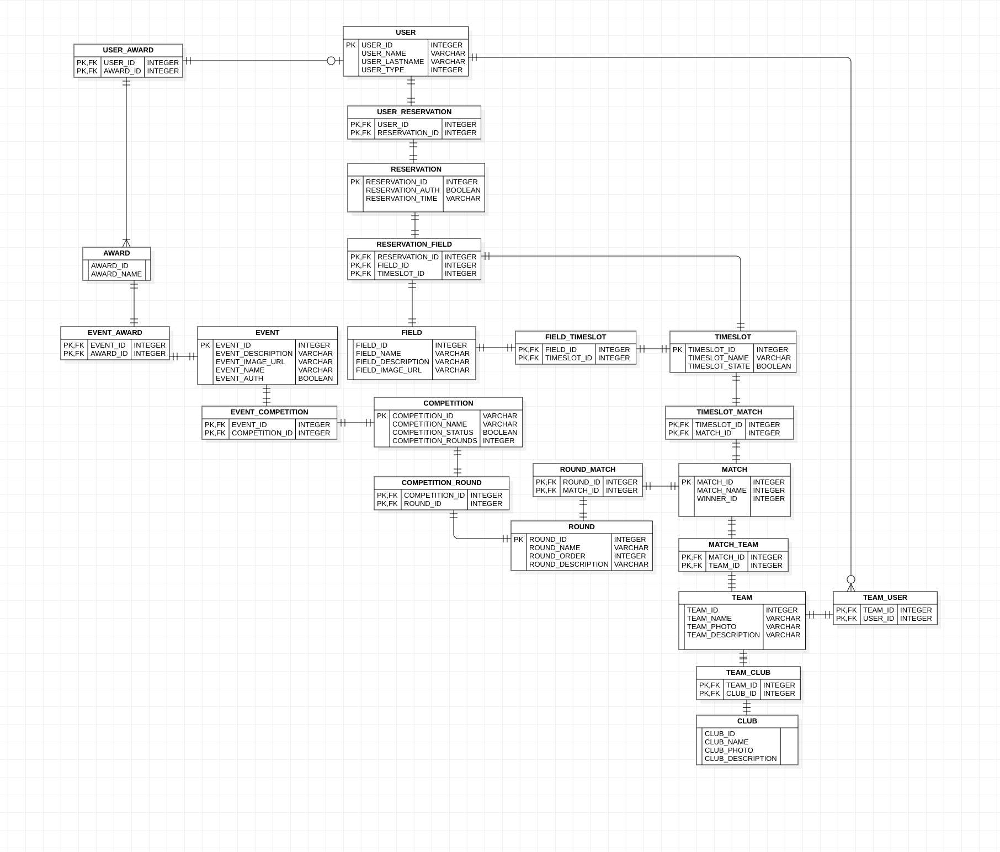
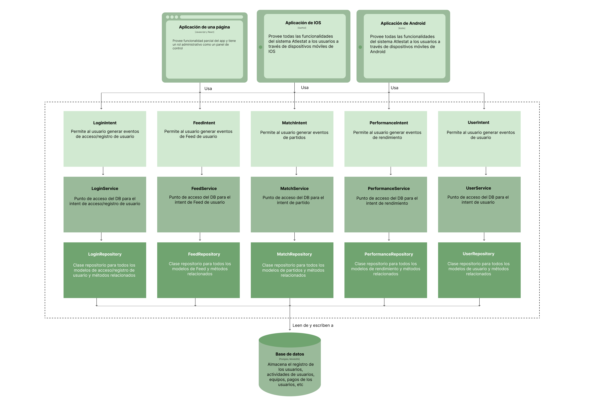

# Decisiones a nivel de arquitectura (planguage)
Planguage, creado por Tom Gilb en 1988, es un lenguaje de planificación que, aunque informal, posee una estructura clara basada en palabras clave para definir requisitos de cualquier tipo. Al combinar elementos del lenguaje natural con una estructura formal, Planguage se convierte en un Lenguaje Natural Restringido que simplifica la comunicación de ideas complejas, especialmente en el campo de la ingeniería competitiva, tal como se detalla en el libro Competitive Engineering.
La riqueza de Planguage en la especificación de requisitos minimiza las omisiones, mejora la claridad y reduce la ambigüedad, facilitando la comprensión y detección temprana de problemas de viabilidad y pruebas. Además, promueve la reutilización de requisitos, lo que a su vez permite una gestión de prioridades más eficiente y una toma de decisiones más ágil y fundamentada.
En el contexto de la toma de decisiones a nivel de arquitectura, se adaptará una plantilla basada en Planguage para generar Decision Records de Arquitectura (ADR) en el marco de EdgeX Foundry.
Fuente: https://docs.edgexfoundry.org/2.3/design/adr/template/
La redacción y especificación de esta plantilla se encuentra en el siguiente repositorio de GitHub donde se describe y enumera los pasos para registrar la toma de decisiones de arquitectura planteada.
Fuente: https://github.com/joelparkerhenderson/architecture-decision-record/tree/main/locales/es/plantillas/plantilla-de-registro-de-decisi%C3%B3n-usando-planguage

# Asignación de responsabilidades

La aplicación de Atestat esta conformada de los siguientes módulos: 
- Módulo de Acceso/ Registro al sistema: En este componente se busca implementar el registro y acceso al sistema de forma segura, además, se busca generar tokens de seguridad y credenciales que se puedan grabar en el dispositivo. 
- Módulo de Feed del usuario: En este componente se busca implementar el muro del usuario donde se muestran partidos en vivo, partidos pasados, y estado del equipo en el que se encuentra el usuario. 
- Módulo de Personalización del usuario: En este componente se busca implementar el perfil del usuario y la modificación de este, sus datos, imágenes y equipos al cual pertenece. 
- Módulo de Coaching en vivo: En este componente se busca implementar lo que la gestión de partidos en vivo en los cuales se puede registrar cambios que suceden en el partido de forma inmediata y al instante. Estos cambios deben ser visualizados en vivo por los otros usuarios a los cuales les aparece los partidos. 
- Módulo de Rendimiento del participante: En este componente se busca implementar lo que es la generación de estadísticas del rendimiento de un jugador a través de los registros que ha generado el usuario entrenador o asistente del entrenador. 

Para esto se toma esta decisión a nivel de arquitectura: 
- Contexto: La aplicación necesita tener una estructura organizada y claramente segmentada para que se permita el trabajo modular, en este caso, porque es crucial que la aplicación sea desarrollado en conjunto de múltiples desarrolladores. Esto se debe a que el app se va a desarrollar para dos plataformas, IOS y Android.
- Diseño de propuesta: Se esta considerando un código base con distintas funcionalidades dirigidas al contenido de todos los módulos mencionados, es por eso que se esta optando por aplicar una aplicación monolítica.
- Consideraciones: También se ha considerado una arquitectura de microservicios dado los módulos existentes en la aplicación pero inicialmente se esta optando por el uso de un solo código base. 
- Decisión: Se va a utilizar una aplicación monolítica con distintas funciones empresariales relacionadas a los módulos que se han planteado. Estos módulos parten de un monolíto donde se ejecutan distintas funciones segmentadas para cada tipo de módulo. 

# Modelo de coordinación

- Contexto: Se necesita comunicación entre los distintos componentes de la aplicación y los servicios de los módulos. Para este se quiere plantear una comunicación que incluya el concepto anterior de monolíto y los distintos módulos. 

- Diseño de propuesta: Se propone utilizar un mediador como modelo de coordinación donde gestiona la comunicación entre los módulos sin la necesidad de que se comuniquen directamente entre ellos. 

- Consideraciones: Se había considerado un modelo de coordinación distribuido donde un solo componente era responsable de la comunicación entre ellos, pero se opto por implementar este tipo dado que se ajusta mejor con la segmentación clara e independencia entre módulos. 

- Decisión: Se va a utilizar un modelo de coordinación a través de un mediador, donde este componente será responsable de coordinar la comunicación entre módulos sin la necesidad de la comunicación directa entre ellos. 

# Modulo de Datos

# Mapeo entre elementos de arquitectura

# Elección de tecnología

## Caso de uso 0: Acceso/ Registro de usuario
- Registro de cambios: Aprobado
- Contexto: Para el acceso/registro de usuario se plantea que el usuario cumpla con ciertos requisitos de seguridad como una extensión de 8 carácteres, carácteres especiales, mayúsculas y minúsculas. Pero se quiere que haya tokens que garanticen la seguridad. 
- Diseño propuesto: GraphQl como backend en conjunto a AWS cognito para la generación de tokens de seguridad. Donde AWS es utilizado para el despliegue del aplicativo. 
- Consideraciones: La seguridad mediante tokens fue contemplado desde la concepción del aplicativo por lo que el acceso/registro se ha diseñado con la intención de implementar tokens desde el inicio. 
- Decisión: Utilizar AWS Cognito integrado al backend de GraphQl para generar tokens de seguridad que son implementados con el fin de tener un acceso/registro seguro.

## Caso de uso 1: Feed de usuario
- Registro de cambios: Aprobado
- Contexto: Se desea que el feed del usuario esté constantemente actualizado y sea notificado de cambios acorde al tiempo. Esto dado que los partidos están sujetos a cambios en relación al tiempo o eventos, como receso de medio tiempo o goles en el partido. Para esto se plantea el uso de suscripciones y conexiones activas de WebSocket. 
- Diseño propuesto: Para que los partidos estén constantemente actualizados y se tenga una conexión activa se va a usar suscripciones de GraphQl que proviene del API del aplicativo. Para esto se van a manejar estados en la interfaz gráfica para actualizar si es que se detectan cambios. Estos estados que se usan, pueden ser los que se emplean en Kotlin o SwiftUi.  
- Consideraciones: En caso de que haya un problema de red se debe generar aviso de red que notifique que el feed no está actualizado o no se ha podido actualizar. Se debe colocar avisos gráficos para recargar o volver a conectar la suscripción cuando regrese una red estable. 
- Decisión: Para que el feed de usuario esté conectado constantemente y actualizado se va a utilizar suscripciones de GraphQl por el lado del backend y se va a actualizar mediante estados de la interfaz gráfica del sistema operativo IOS/Android, que en este caso se implementa mediante Kotlin o SwiftUi respectivamente.

## Caso de uso 2: Personalización de usuario
- Registro de cambios: Aprobado 
- Contexto: En lo que respecta a la personalización del usuario, se requiere que adicional a los datos de este, se pueda cargar una imagen que permita identificar su perfil.
- Diseño propuesto: El backend de GraphQl va a contar con una conexión a Amazon S3 mediante su api, la cual va a permitir la carga y subida de las imágenes.
- Consideraciones: Se busca contar con un servicio simple pero bien estructurado que nos permita manejar solicitudes de carga y descarga de imágenes.
- Decisión: Utilizar Amazon S3 API a través GraphQl de para garantizar un buen rendimiento y seguridad a la hora de cargar y subir las imágenes de los perfiles.

## Caso de uso 3: Coaching en vivo
- Registro de cambios: Aprobado
- Contexto: Se desea que el panel de control para el coaching en vivo esté constantemente actualizado. Esto se debe a que el partido está sujeto a cambios en relación al tiempo y eventos. Por esto se piensa implementar suscripciones de GraphQl para tener una conexión activa y constante acompañada de una interfaz actualizada mediante estados. Además, se desea que los cambios de un partido en vivo se guarden en memoria local para evitar pérdidas de datos en caso de que se dejé de conectar a la red o se ponga offline por un momento. 
- Diseño propuesto: Para que los partidos se actualicen en vivo se va a aplicar GraphQl en el backend con suscripciones.
- Consideraciones: Para garantizar una experiencia de coaching en vivo óptima, se implementará un almacenamiento en caché local para preservar los cambios del partido en caso de desconexiones temporales. Además, se incorporarán mecanismos de detección y manejo de errores de red, notificando al usuario y reconectarlo automáticamente cuando sea posible. Se establecerá un proceso de sincronización para actualizar los datos locales con el servidor al recuperar la conexión. También se optimizará el uso de recursos y ancho de banda para asegurar un rendimiento fluido de las suscripciones de GraphQL, especialmente en dispositivos móviles. Finalmente, se aplicarán medidas de seguridad robustas para proteger los datos sensibles transmitidos y almacenados durante el proceso de coaching.
- Decisión:Para mantener el panel de control del coaching en vivo constantemente actualizado, se implementarán suscripciones de GraphQL en el backend. Esto permitirá una conexión activa y constante con el servidor, reflejando los cambios en tiempo real a través de actualizaciones de estado en la interfaz de usuario.

## Caso de uso 4: Rendimiento del participante
- Registro de cambios: Aprobado
- Contexto: Para garantizar claridad en lo que respecta al visualizado del rendimiento, se va a requerir de contar con gráficos dinámicos y que permitan realizar filtraciones a gusto del usuario. Por lo cual se va a requerir el uso de librerías que permitan llevar a cabo estas características.   
- Diseño propuesto: En el caso de IOS se empleará la librería Swift Charts, mientras que en Android se utilizará MPChartLib.
- Consideraciones: Se busca que las librerías sean robustas y cuenten con varias funcionalidades que permitan desarrollar gráficos agradables y que permitan cubrir satisfactoriamente las características que se están buscando para el apartado visual y técnico.
- Decisión: Para dinamizar la creación de los gráficos y el filtrado por partidos, se van a implementar las librerías Swift Charts y MPChartLib dentro del código fuente del aplicativo en sus respectivos sistemas operativos.

## Frontend:

- Lenguajes: Se utilizará Kotlin para el desarrollo en Android y Swift UI para iOS, dado su liderazgo en sus respectivos ecosistemas, garantizando una amplia audiencia, tecnología a prueba de futuro, innovación constante y rendimiento óptimo.
- Entornos de Desarrollo (IDEs):
- Android: Android Studio, por ser el IDE oficial de Google, ofrece un conjunto completo de herramientas para el desarrollo en Kotlin y Java, como editor inteligente, emulador versátil, análisis de rendimiento y depuración.
- iOS: Xcode, exclusivo para el desarrollo en el ecosistema Apple, proporciona herramientas poderosas como editor inteligente, Interface Builder, simuladores, depuradores e instrumentos de rendimiento, además de integración nativa con los frameworks y APIs de Apple.

## Backend:

- API: Se utilizará GraphQL como API de acceso a los servicios de base de datos debido a su flexibilidad, eficiencia y capacidad para adaptarse a las necesidades específicas de cada aplicación. GraphQL permite obtener datos de forma precisa, optimizando el rendimiento y facilitando la evolución continua de la API.
- Base de Datos: Se emplearán dos opciones:
PostgreSQL: Para aprovechar la experiencia del equipo de desarrollo en esta tecnología robusta y versátil, que ofrece escalabilidad, gestión de grandes volúmenes de datos y ejecución de consultas complejas.
- Firebase (Realtime Database o Firestore y Firebase Storage): Para simplificar el desarrollo y permitir una rápida iteración gracias a su modelo de datos NoSQL y su integración con otras herramientas de Firebase. Firebase Storage proporciona una solución escalable y segura para almacenar y servir archivos multimedia desde la nube.

