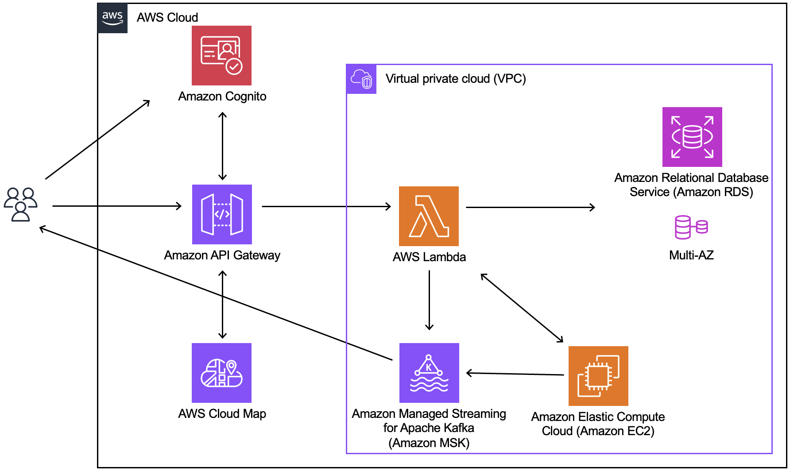
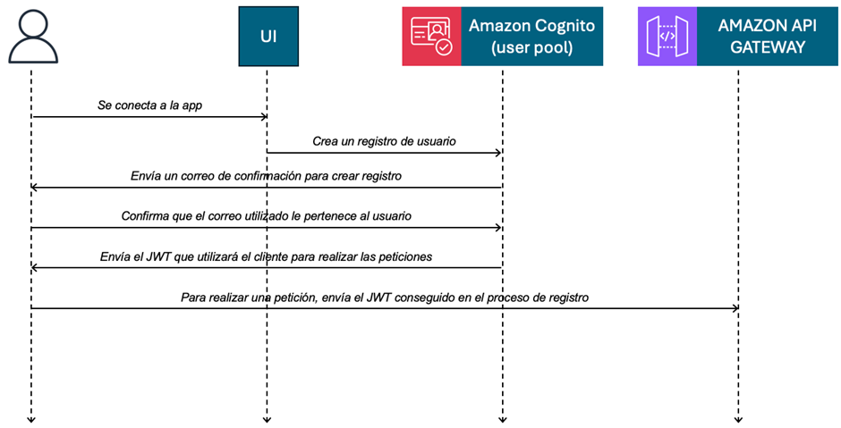
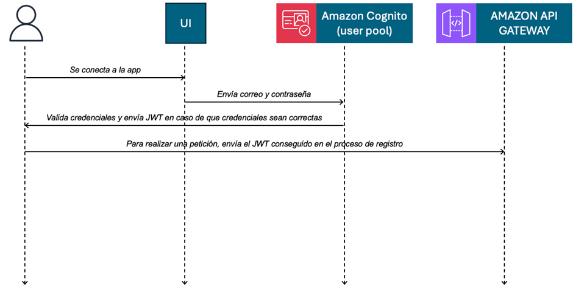
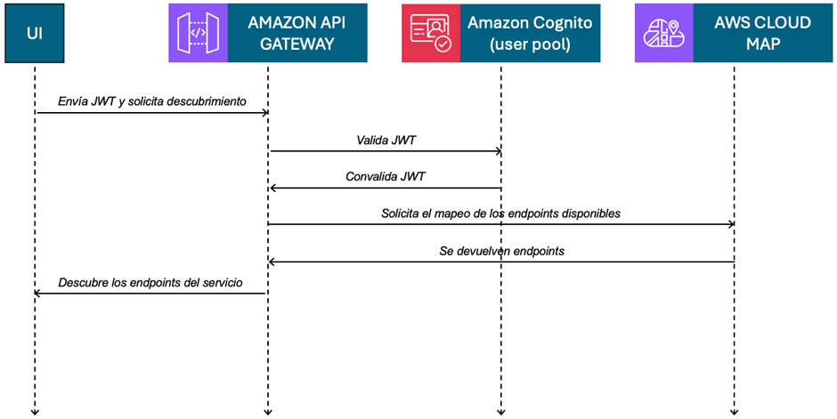
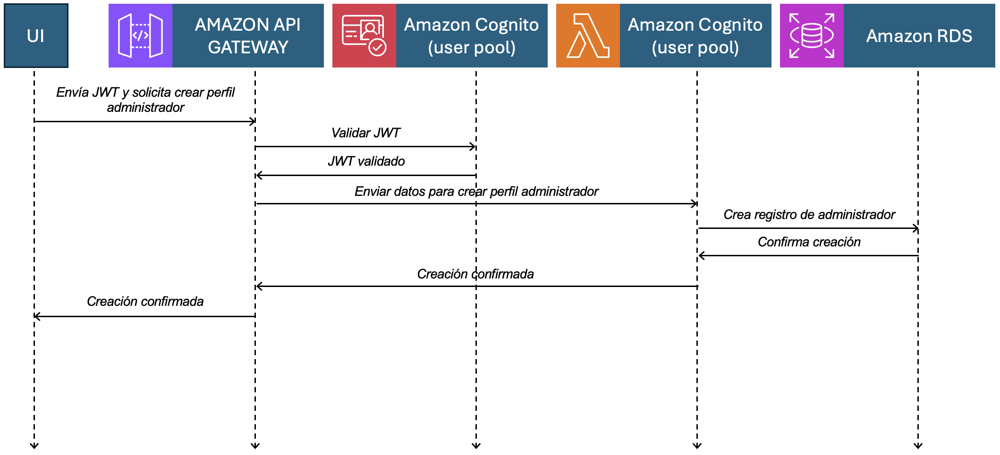

# **Escenarios**

- Diagrama del software completo: 

## Diccionario:

- PERSONA: Tabla principal de la base de datos Atlestat, la cual almacena la información de la cuenta registrada. 
- AMAZON WEB SERVICE (AWS): plataforma de servicios en la nube que ofrece una amplia gama de servicios integrales de centros de datos a nivel global.
- RDS: Amazon Relational Database Service es una colección de servicios administrados que facilita las tareas de configuración, operación y escalado de una base de datos en la nube.
- AMAZON COGNITO: directorio de usuarios, un servidor de autenticación y un servicio de autorización para los tokens y credenciales de AWS.
- USER POOL: directorio de usuarios para la autenticación y autorización de aplicaciones web y móviles.
- JSON WEB TOKEN: cadena de texto que funciona com token de seguridad, el cual contiene información verificable sobre el usuario autenticado, como su identidad y atributos.

## Escenario 1:

Como nuevo usuario de la aplicación, se desea poder registrar una cuenta en la aplicación con el correo electrónico como login option. Para poder realizar el formulario y la autenticación del usuario se está empleando Amazon Cognito. 

En lo que respecta al formulario del registro, se requiere principalmente contar con un correo existente y una contraseña que cumpla con una serie de requisitos de seguridad, los cuales son:

- La contraseña debe contener por lo menos una letra en mayúscula y una letra en minúscula.
- La contraseña debe contener un carácter especial.
- La contraseña debe contener un número.
- La contraseña debe ser de por lo menos una longitud de ocho caracteres.

Cuando un registro se ha completado de forma satisfactoria, este nuevo usuario será almacenado en el User Pool creado con este servicio. Cuando se crea este nuevo usuario se ejecuta un trigger que acciona una función Lambda, esta está encargada de crear una nueva PERSONA dentro de la base de datos creada con el servicio RDS de AWS.

A través de Amazon Cognito, se están aplicando atributos de calidad como seguridad, rendimiento, disponibilidad y escalabilidad. En lo que respecta a la seguridad, este servicio cuenta con una política de contraseñas robusta y con un sistema de almacenamiento de datos de los usuarios que ofrece una alta confiabilidad frente a accesos de terceros. Por otro lado, este servicio nos ofrece una alta disponibilidad, dado que se ejecuta en la infraestructura global de AWS. Por esta misma razón, el rendimiento que se puede alcanzar con este servicio cumple satisfactoriamente con lo requerido para que se puedan ejecutar las operaciones de forma eficiente. Dado a que Amazon Cognito es serverless, no se presenta un límite en la cantidad de usuarios a registrar permitiendo escalar la aplicación con facilidad a medida que esta va creciendo.

### Diagrama Escenario 1

## Escenario 2:

Como usuario de Atlestat, se desea iniciar sesión en el aplicativo, para lo cual este debe proporcionar sus credenciales a través de un formulario en la aplicación. Estas credenciales se envían a Amazon Cognito mediante una solicitud de autenticación. Cognito valida las credenciales proporcionadas contra el User Pool. Durante la solicitud que se realiza para el LogIn se debe establecer el parámetro response_type como token. Este parámetro se encarga de devolver una concesión de código de autorización. Si este inicio de sesión es correcto, Amazon Cognito crea una sesión y genera tres tipos de Json Web Tokens:

- Token de ID, el cual contiene información sobre el usuario como nombre, correo electrónico y atributos personalizados.
- Token de acceso, utilizado para autorizar solicitudes a los recursos protegidos de la aplicación.
- Token de actualización para el usuario autenticado, el cual permite obtener nuevos ID y Access Tokens sin necesidad de volver a autenticarse.

Estos tokens se pueden utilizar para conceder a los usuarios acceso a las API y los recursos descendentes, o para validar al usuario cada vez que este desee hacer una petición. 

### Diagrama Escenario 2

## Escenario 3:

El cliente tras terminar su registro cuenta con un Json Web Token y los datos de este usuario almacenados de forma permanente en la aplicación. Con esto, se puede crear uno de los cuatro tipos de usuarios que soporta el aplicativo. Es necesario que, en primera instancia, el usuario pase por un descubrimiento de los endpoints disponibles, esto mediante peticiones al API Gateway con el envío del Json Web Token correspondiente. Este API Gateway es el encargado de gestionar los endpoints mediante un diccionario, con la finalidad de que el usuario solo tenga almacenada la información que le permita realizar las solicitudes al API y esta lo redireccione al endpoint requerido. 

Es de suma importancia recalcar que Amazon Cognito debe validar que esta petición de descubrimiento sea válida por medio del Json Web Token. El API Gateway se encarga de realizar la comunicación con Cognito para corroborar la validez de la petición y poder devolver el diccionario de endpoints al cliente.

Mediante el uso de este servicio de AWS, se está cumpliendo el patrón de Componentes y Conectores llamado Broker. Esto debido a que actúa como un intermediario que desacopla a los clientes de los servicios disponibles, gestionando todas las interacciones entre ellos. Permitiendo que los clientes no necesiten conocer las ubicaciones o rutas específicas de los servicios. 

### Diagrama Escenario 3

## Escenario 4:

Una vez que el cliente ya ha ingresado a la aplicación, este va a tener que crear un tipo de perfil. Para esto, se debe emplear el diccionario de endpoints que nos facilita el API Gateway, enfocando este escenario en la creación de un perfil de tipo administrador. Una vez se ha identificado cuál es el endpoint necesario para hacer el tipo de petición requerida, se procede a hacer la petición adjuntando el Json Web Token del cliente para que el API Gateway pueda validarlo con Cognito. En caso la petición se haya verificado correctamente, se crea el perfil administrador mediante el llamado a una función Lambda encargada de crear un query con todas las características requeridas para el endpoint solicitado y almacene el nuevo registro en la base de datos RDS en la tabla administrador. Cuando se crea el registro, la función Lambda recibe un mensaje de confirmación y se encarga de devolver una respuesta al cliente mediante el API Gateway. 

## Escenario 5:

Para que cualquier usuario de la aplicación Atlestat pueda crear un nuevo registro en la tabla de institución, es necesario que desde el front end se valide que el usuario solicitante sea de tipo persona y cuente con un perfil de tipo administrador. Una vez realizada esta validación, se accede al endpoint correspondiente para registrar la nueva institución mediante una petición de tipo POST, enviando el body con la información necesaria. El API Gateway se encargará de validar el Json Web Token recibido y de comunicar la solicitud a la función Lambda. Esta función Lambda verificará que el usuario tenga el perfil de administrador y procederá a crear el nuevo registro en la tabla de institución. Además, este nuevo registro estará relacionado con el registro en la tabla de administrador correspondiente al usuario que solicitó la creación.