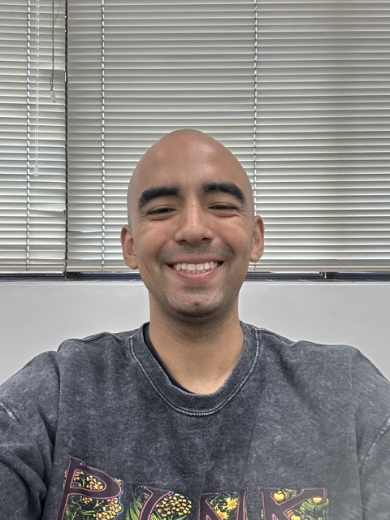

# Marco Landauro

Marco Landauro es un estudiante de 10mo ciclo en la Universidad de Lima. También es practicante del laboratorio ITLAB en la Universidad de Lima. Está enfocado en la programación móvil, especializado en desarrollo para iOS.

[Ver integrantes](../integrantes.md)

[Regresar al índice](../../proyecto.md)