# Demostracion de pruebas de estres con JMeter

## Que es JMeter

JMeter es una herramienta de software de código abierto desarrollada por Apache Software Foundation, utilizada principalmente para probar el rendimiento y la carga de aplicaciones. Esta permite realizar una simulacion de peticiones HTTP con ciertas caracteristicas, como numero concurrente de usuarios o numero de veces que se realiza la peticion por usuario

Siendo uno de los software de pruebas mas antiguos y utilizados de la industria, este se ha visto integrado en diferentes proyectos, ya sea como una herramienta para pruebas de cargas o de estres. Tambien es posible automatizar el proceso de pruebas, logrando ser muy util para realizar comprobaciones en entornos con CI o similares.

## Conseguir JMeter

Lo primero es descargar JMeter desde la [pagina oficial](https://jmeter.apache.org/download_jmeter.cgi). Tambien, debemos tener instalado el JDK de Java instalado, ya que el software esta hecho enteramente en Java

Posteriormente, descomprimiremos los archivos y los colocaremos en nuestra ubicacion de preferencia. Finalmente, en caso de Windows correremos el archivo jmeter.bat ubicado en la carpeta **bin**; en caso de macOS o Linux se debera utilizar el archivo jmeter.jar.

Es recomendable que se guarde la ubicacion del archivo como una variable de ambiante o en el PATH del dispositivo, para acceder rapidamente a JMeter.

## Backend de prueba

Para esta demostracion se utilizara un backend sencillo, el cual recibe un numero a contar y empieza a contar hasta dicho numero. Para correr el servicio utilizaremos los siguientes comandos en la carpeta Demo (asumiendo que se tenga docker instalado):

```
docker compose build
docker compose up
```
Esto levantara una instancia en el puerto 3000 del computador. Antes de continuar con la demo es necesario que corran esta instancia de docker.

## Crear un plan de pruebas

En JMeter las pruebas se manejan por planes. Al ingresar observaremos que tenemos un plan ya creado.

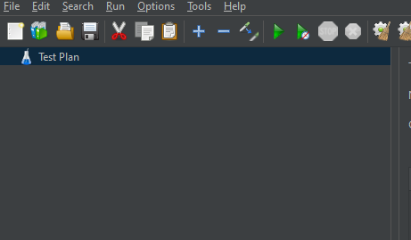

La demostracion ya trae un ejemplo de plan de pruebas creado en el archivo test.jmx. Por ahora abramos el archivo, donde deberiamos ver lo siguiente:

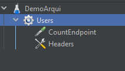

Veremos que hay nuevos objetos en el explorador. Repasemos cada uno de ellos:

- DemoArqui: Es el plan de pruebas, el contenedor del resto de elementos de esta lista
- Users: Es el pool de usuarios, los cuales correran un conjunto de peticiones enlistadas
- CountEndpoint: Es una peticion HTTP de tipo POST que apunta a un endpoint local. Cabe resaltar que se pueden tener multiples peticiones listadas en un mismo plan de pruebas
- Headers: Las cabeceras que iran en cada peticion HTTP

Para agregar alguno de estos objetos, basta con hacer clic derecho sobre el pool de usuarios y darle al botton "Add" seguido de lo que deseemos agregar. En caso de agregar otro pool de usuarios, deberemos hacer clic sobre el nombre del plan de pruebas y seguir el mismo proceso.

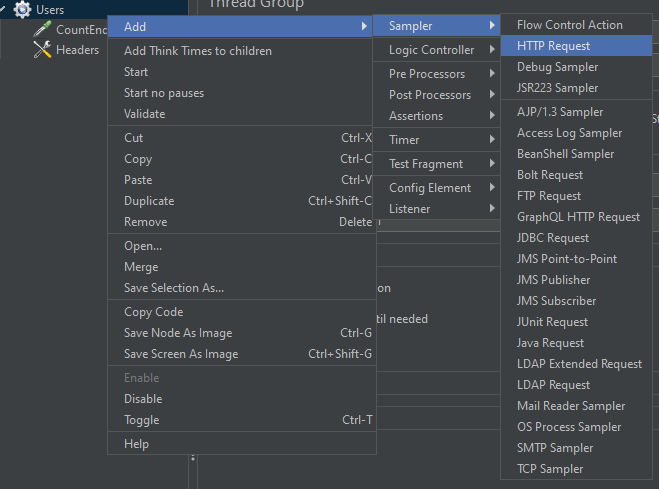

Siguiendo este metodo, podemos armar nuestras pruebas segun hayamos definido previamente de manera logica.

## Prueba de estres a endpoint

Antes de realizar la prueba, debemos revisar con que parametros la estamos realizando. Si nos dirigimos al pool de usuario, veremos una lista de parametros que podemos personalizar:

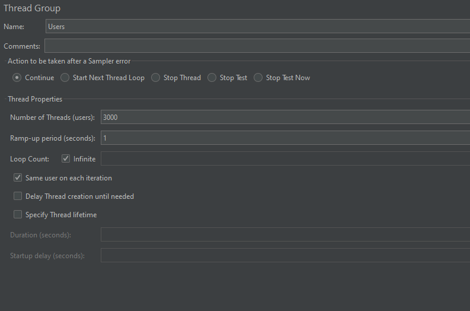

La mayoria de valores se han dejado por defecto. Lo que se a cambiado es el numero de usuarios o "Threads", el periodo de "Ramp-up" y el contador de vueltas. Explicando que es cada uno de estos parametros, los threads o usuarios son el numero de peticiones que realizaran por vuelta. El periodo de "Ramp-up" define el tiempo en el que se llegara al maximo de usuarios determinados. Colocar un tiempo de 0 significa que los usuarios se instancian y realizan su peticion al instante. Por lo general se busca un balance entre este valor y el numero de usuarios y el periodo de "ramp-up" de manera que las pruebas fueran mas realistas. 

En este caso probaremos con 3000 usuarios simultaneos cada segundo realizando peticiones al endpoint determinado. En caso se utilice un dispositivo con bajos recursos lo ideal seria reducir estos numeros o ir tanteando por un valor que permita realizar el flujo de pruebas.

Otro detalle son las peticiones. Primero debemos definir las cabeceras, ya que el cuerpo de la peticion sera en formato JSON. Para ello accedemos al objeto Headers, donde ya veremos que la cabecera que define el formato(content-type) esta colocada:

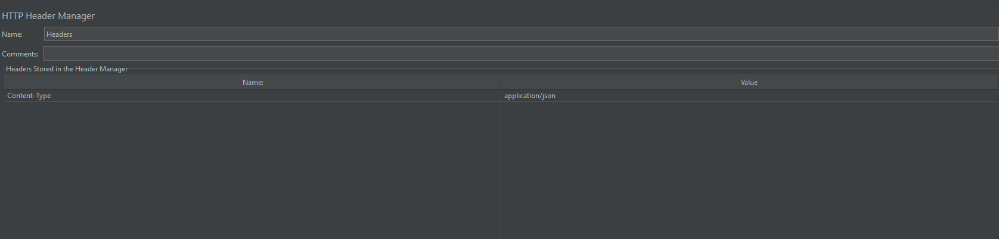

Por ultimo, debemos revisar la peticion. Para ello nos ubicamos en el objeto CountEndpoint. En el veremos que solicita el protocolo (http o https), el servidor, el puerto de ser necesario, el tipo de peticion, la ruta y el encoding de los datos. Asimismo, permite agregar parametros, cuerpo o archivos a la peticion:

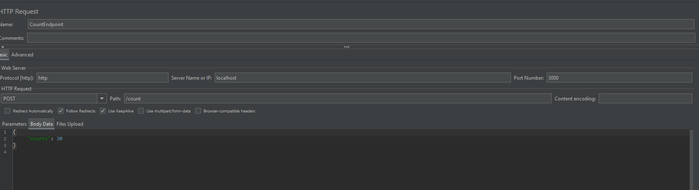

En este caso ya esta configurado para realizar la peticion al endpoint predeterminado. Si se desease cambiar la configuracion o realizar otra peticion en el plan de pruebas para el pool de usuarios la configuracion seria similar, dependiendo del caso.

En este momento uno podria reproducir las pruebas y comprobar el estado del servicio con software como Graphana o similares, que vigilen el estado del servidor. Pero el mismo JMeter recolecta metricas comunes en este tipo de pruebas. Para ello, daremos click derecho sobre el nombre del pool y colocaremos el cursor sobre la opcion Add y posteriormente Listeners. Esto abrira una lista de opciones, donde escogeremos "Summary Report" y "Graph Results". El listado de objetos cambiara a lo siguiente:

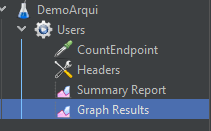

La primera nos permitira ver un resumen de las estadisticas en el plan de pruebas, mientras que el segundo mostrara un grafico de lineas progresivo en base al tiempo que mostrara los resultados obtenidos por cada metrica. 

Ahora si, para iniciar el plan de pruebas le daremos al boton verde de la zona superior. Es posible que su computador se ralentice debido a la creacion de tantos usuarios paralelos. En caso suceda reduzca el numero de usuarios o utilice un periodo mas alto.

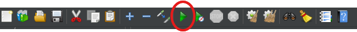

Al presionar dicho boton, las peticiones empezaran a realizarse como lo solicitamos. Si revisamos el Summary Report o los Graph Results observaremos los resultados obtenidos hasta el momento. Este seria el resultado obtenido luego de 4 minuto:

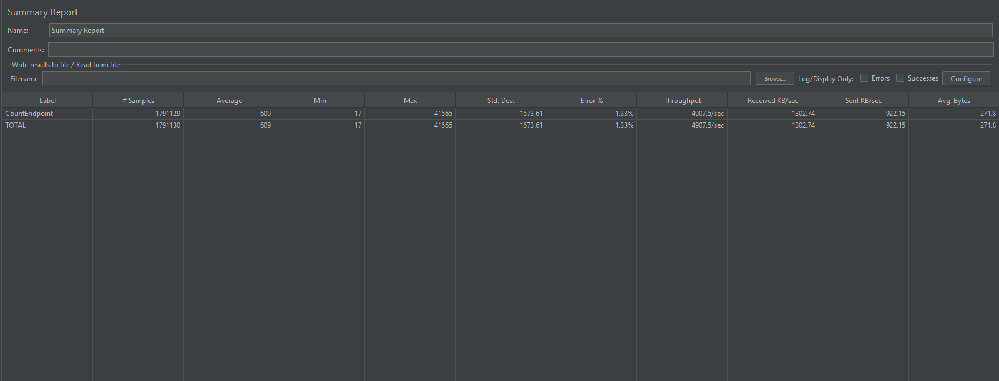

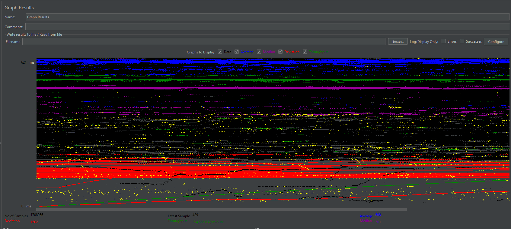

Asimismo, podemos observar los recursos utilizados por el contenedor en la aplicacion de docker desktop:

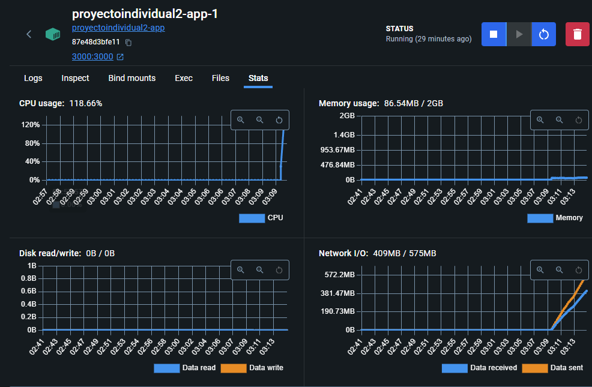

De esta manera, identificamos que realmente el endpoint realiza operaciones computacionalmente costosas, pero que no se ve perjudicada en gran medida por la memoria. Con esa conclusion, la prueba de estres logro su cometido, identificando un cuello de botella y una limitacion, como lo son 3000 usuarios concurrentes por un largo periodo de tiempo.

Para frenar las pruebas podemos presionar el signo de STOP en la barra superior:

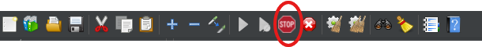

# Video

[Drive (Acceder con cuenta ulima)](https://drive.google.com/file/d/19UlT1H5TNx0lU16CnynkN3MUkDe08Pkz/view?usp=sharing)