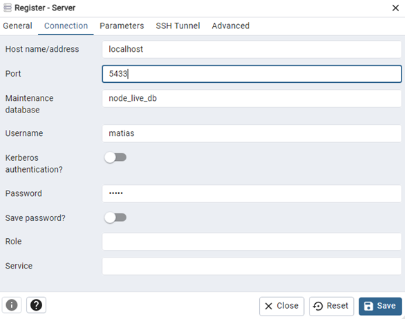

## Desarrollo Conceptual

Una aplicación puede comenzar enfocándose en una interfaz web de escritorio, desarrollando un backend que soporte sus funciones. Con el tiempo, al crecer la base de usuarios, se crea una aplicación móvil que debe interactuar con el mismo backend. Esto convierte al backend en un servicio de propósito general que debe servir tanto a la interfaz de escritorio como a la móvil. Sin embargo, dadas las diferencias de cada dispositivo, los requerimientos pueden verse alterados. Para cubrir esta problemática, Newman (2015) desarrollo el patrón Backend For Frontend (BFF). Este implica diseñar un backend distinto para cada tipo de experiencia de usuario, en lugar de emplear un único backend general que soporte todas las interfaces. Cada debe contar con su propio back, adaptado para satisfacer los requerimientos específicos.

Este patrón puede ser utilizado cuando se necesita proporcionar funcionalidad específica para una interfaz móvil o de terceros, sería muy recomendable usar un BFF para cada uno desde el principio. Podría reconsiderar esta opción si el costo de desplegar servicios adicionales es alto, pero la separación de responsabilidades que aporta un BFF lo hace una opción atractiva en la mayoría de los casos. La idea de usar este patrón es aún más convincente si existe una separación significativa entre los equipos que construyen la UI y los servicios subyacentes, debido a los beneficios ya mencionados.

### Figura 1.1
Diagrama patrón BFF

## Problemas y Consideraciones

- Problemas y Consideraciones

- Si diferentes interfaces harán las mismas solicitudes, considerar si solo backend será suficiente.

- La duplicación de código entre servicios es muy común en este patrón.

- Los servicios de backend centrados en frontend solo deben contener lógica y comportamiento específicos del cliente. 

- Se debe tomar en consideración cuánto tiempo llevará implementar este patrón.

## Demo

Para la demo se desarrollaron dos backends, uno para una interfaz web y otro para una interfaz móvil, y dos frontend para poder realizar las peticiones. Los backends fueron desarrollados en Java Script, utilizando Nodejs, Express, Postgres, Sequelize y Docker. Es importante que, para configurarlos con Docker, se realicen una serie de pasos. En primer lugar, se debe clonar el repositorio donde se aloja el proyecto. Una vez se ha clonado, cada backend tiene ya configurados los parámetros necesarios para crear la imagen y el contenedor, por lo que se puede iniciar el proceso de creado de la imagen ingresando el comando docker compose up -d node_db en una terminar Git Bash. 

### Figura 3.1
Comando para crear imagen

Tras crear la imagen, esta se puede verificar utilizando el comando docker ps -a.

### Figura 3.2
Listado de imágenes

Al confirmar que la imagen se ha creado correctamente, se debe verificar que la base de datos se esta ejecutando correctamente. Para esto se puede utilizar la herramienta PGAdmin, en la cual se debe configurar la conexión de la siguiente forma para el caso del backend Web. Los datos del usuario se encuentran en el archivo docker-compose.yml y en la configuración del backend móvil se debe utilizar el puerto 5432.

### Figura 3.3
Configuración Backend Web

Tras configurar el servidor, se procederá a ingresar los comandos docker compose build y docker compose up --build para completar el proceso.

### Figura 3.4
Comandos para realizar build

Una vez se ha terminado con el proceso de creación del contenedor, se puede realizar pruebas de peticiones para cada backend. Las rutas en el backend web empiezan con la url http://localhost:3003/users, mientras que para el backend móvil se utiliza http://localhost:3001/users. Para poder registrar un usuario se puede realizar una petición de tipo POST de la siguiente forma, donde el contenido del body dependerá de los campos que se requieran dependiendo de cada plataforma.

### Figura 3.5
Ejemplo petición POST

