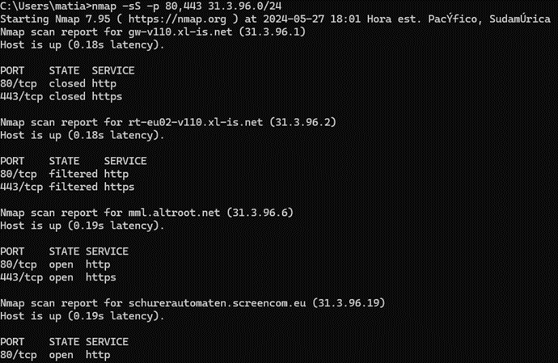

# **Tópicos en Arquitectura de Software**

## 1. Tema

Para el siguiente componente individual del trabajo, se abordará el tema de Hacking ético, el cual pertenece a la categoría de Seguridad.

## 2. Desarrollo Conceptual

Según Palmer (2001), la definición de hacker tradicionalmente se refiere a una persona que disfruta aprendiendo los detalles de los sistemas informáticos y cómo ampliar sus capacidades, ya sea mediante la creación de nuevos programas o modificando software existente, reflejando entusiasmo hacia la programación y el deseo de explorar las posibilidades de los sistemas. Sin embargo, en los últimos años esta definición ha obtenido un nuevo significado. Ahora se refiere a personas que penetra maliciosamente en sistemas con fines personales, buscando beneficios personales como fama, lucro o venganza (Farsole et al., 2010). Estos logran tener accesos forzados a sistemas para modificar, eliminar y roban información crítica.

Con el auge de Internet, la seguridad informática se ha vuelto una prioridad clave para empresas y gobiernos. A pesar de su interés en aprovechar las oportunidades del comercio electrónico y el acceso a la información, existe preocupación por posibles ataques cibernéticos. Además, usuarios también presentan inquietudes por proteger su información personal, como números de tarjetas de crédito y direcciones de posibles atacantes. (Palmer, 2001). En la exploración de soluciones frente al problema de la piratería informática, las organizaciones han llegado a la conclusión de que una estrategia efectiva radica en involucrar a profesionales en seguridad informática, para que realicen intentos de ingreso a sus sistemas informáticos. Siendo este el inicio de lo que se puede denominar hackers éticos, definido por Sahare et al. (2014) como aquellos hackers que emplean las mismas herramientas y técnicas que los intrusos, pero no dañan los sistemas objetivo ni roban información. Estos acceden con la finalidad de evaluar la seguridad de los sistemas objetivo e informan a los propietarios sobre las vulnerabilidades que encontraron y las instrucciones sobre cómo remediarlas. 

Farsole et al. (2010) mencionan que para el proceso de planificación de hacking ético es necesario establecer tanto las estrategias como las tácticas necesarias para llevar a cabo las pruebas de manera efectiva. La aprobación del plan de hacking ético es un paso primordial que requiere el respaldo y la aprobación de un patrocinador del proyecto, dado que la falta de autorización puede resultar en la cancelación abrupta de las pruebas. Además, enfatizan en que es crucial evitar errores durante las pruebas, ya que estos podrían tener consecuencias graves, como el colapso de los sistemas bajo evaluación. 

El hacking ético implica la realización de pruebas de penetración (Pentest) o auditorías de seguridad en sistemas informáticos, con la autorización de la empresa u organización, con el objetivo de encontrar fallos de seguridad y reportarlos. OWASP (2020) ofrece una guía para seguir el estándar de ejecución de pruebas de penetración, que brinda sugerencias a lo largo de siete fases sobre los procedimientos a realizar para este tipo de evaluaciones. En primer lugar, se tienen las interacciones previas al compromiso, la etapa inicial en la que se establece una comunicación con la organización interesada y se define el alcance de las pruebas a realizar. En segundo lugar, está la recopilación, donde los encargados de realizar el pentest se enfocan en reunir toda la información posible sobre el objetivo de la prueba. En tercer lugar, se encuentra la fase de modelado de la amenaza. Basándose en la información recopilada, el hacker ético identifica las herramientas o técnicas potenciales con las cuales se podrían explotar las vulnerabilidades. En cuarto lugar, se realiza el análisis de las vulnerabilidades, donde se examina el objetivo para identificar las vulnerabilidades presentes. En quinto lugar, está la fase de explotación, en la cual se procede a intentar explotar las vulnerabilidades identificadas previamente. Es importante resaltar que solo se realiza la explotación de vulnerabilidades acorde al alcance definido en la primera fase. En sexto lugar, se presenta la fase post-explotación. Tras haber obtenido acceso al objetivo mediante alguna de las vulnerabilidades identificadas, se procede a la exploración de los datos. Finalmente, se documentan los hallazgos identificados durante el pentest, cerrando las pruebas con la fase de informe.

El proceso de hacking ético implica el uso de herramientas específicas con la capacidad de poder detectar las vulnerabilidades, aunque estas no siempre tienen la capacidad de detectarlas en su totalidad ayudan a simplificar el proceso. Ushmani (2018) nos brindan una lista de las herramientas empleadas para este tipo de hacking:
- Escáneres de vulnerabilidad
-	Packet Sniffers
-	Crackers de contraseñas
-	Hardware de hacking
También nos mencionan aquellos softwares de código abierto que son empleados para realizar este tipo de tareas:
-	Nmap
-	Ether Peek
-	WebInspect
-	Ethereal
-	Kismet
-	Nikto
-	QualysGuard
-	SuperScan
-	ToneLoc
-	LC4
-	LANguard Scanner de Network Security
-	Nessus
-	Escáneres de internet

Adicionalmente, es de suma importancia que un hacker ético posea habilidades en diversos aspectos, como los protocolos de red, la autenticación, los cortafuegos, las aplicaciones web, así como en lenguajes de programación tales como HTML, Ruby, Python y JavaScript, estas competencias son esenciales para una comprensión exhaustiva y profesional de las redes y sistemas objetivo (Ushmani, 2018). 

## 3. Consideraciones Técnicas

### 3.1. Instalación / Configuración de Servicio

Como se mencionó previamente, una de las herramientas más utilizadas para el hacking ético es el programa Nmap. Este permite a los usuarios mapear redes, evaluar vulnerabilidades y auditar la seguridad de redes, identificar qué puertos están abiertos y las reglas de estos puertos. Por lo que se procederá a dar una breve explicación de como instalar este programa. Para esto, es necesario dirigirse a la página oficial de Nmap y buscar las opciones de descarga. Hoy en día este es un software multiplataforma, por lo que se da la libertad de descargar la versión que corresponda al sistema operativo propio.

### Figura 3.1.1
Opciones de descarga

Cada versión de sistema operativo cuenta con una sección de descarga de la última versión estable, esta es la que se recomienda descargar para evitar posibles problemas con el software.

### Figura 3.1.2
Versión de Nmap más estable

Una vez descargado el instalador, en la primera opción darle al botón “I Agree” y en la sección de componentes a descargar, activar los componentes Npcap y Check online para agregarlos a la descarga.

### Figura 3.1.3
Selección de componentes

Tras esto, se tendrá que darle clic al botón de “Next” y posteriormente al de instalar, tras esto el programa se instalará en la computadora y se podrá utilizar el ejecutable de Nmpa de nombre Zenmap o ejecutar los comandos de Nmap a través del CMD.

### 3.2. Primeros pasos

Existen dos métodos para poder empezar a utilizar Nmap. En primer lugar, se puede realizar todo de forma más visual empleando el ejecutable de Zenmap. Cuya interfaz nos permite seleccionar la red objetivo y nos ofrece diferentes tipos de acciones a realizar con esta. Por ejemplo, si se desea realizar un escaneo a los dispositivos que están conectados a la red, basta con ingresar la ip objetivo y seleccionar el perfil “Intense Scan”, tras esto el programa realizara un escaneo y mostrara la cantidad de dispositivos.

### Figura 3.2.1
Uso de Nmap por interfaz gráfica

Este programa cuenta con una lista amplia de diferentes acciones que se puede realizar a la dirección objetivo. Para acceder a esta lista, se debe seleccionar el botón desplegable ubicado en la parte superior derecha, la cual hace referencia a tipo de perfil del escaneo.

### Figura 3.2.2
Lista de perfiles de escaneo

En segundo lugar, tenemos la ejecución de comandos a través de CMD. Para verificar que este esté correctamente instalado, mediante línea de comandos, será necesario abrir la consola de Windows y ejecutar el comando “nmap”. Tras verificar que está instalado correctamente, se podrán realizar diferentes acciones a una dirección IP objetivo mediante la consola. Por ejemplo, para hacer identificar los dispositivos conectados a una red se debe emplear únicamente el comando “nmap -sP” y la dirección objetivo. Tras ejecutar este comando, se mostrará la cantidad de IP conectadas a la red objetivo.

### Figura 3.2.3
Uso de Nmap por linea de comandos

Para poder explorar los diferentes comandos que se pueden utilizar o investigar que tipos de opciones ofrece este programa, se puede ingresar la linea “nmap –help”. Se desplegará una lista de todos los diferentes tipos de escaneos disponibles y los comandos que pertenecen a cada uno.

### Figura 3.2.4
Lista de comandos y opciones

## 4. Demo

### 4.1. Escenario práctico

José, propietario de Itsec Games, un sitio web de juegos en línea, está preocupado por la seguridad de su plataforma. Reconoce la importancia de proteger los datos de sus usuarios y la integridad de su sitio web. Para garantizar la seguridad de su plataforma, decide contratar a un hacker ético para realizar un escaneo a la página web y verificar la seguridad de esta. El objetivo principal de esta evaluación de seguridad es identificar y mitigar posibles vulnerabilidades en el sitio web itsecgames.com y el servidor en el que se está alojando. Esto incluye la identificación de puertos abiertos, la evaluación de vulnerabilidades de la página web y facilidad de identificar las conexiones e información del servidor. En caso se identifique una vulnerabilidad, José ha cedido el permiso para poder explotarla y ver como es que se comporta la página frente a esta.

### 4.2. Pasos para la demo

En primer lugar, es necesario poder obtener la dirección IP del servidor en el que esta hosteada la web, para lo cual se utilizara la pagina whatweb, la cual se encargara de brindarnos la información necesaria.

### Figura 4.2.1
Información de dirección objetivo

Teniendo esta información, se puede utilizar Nmap para realizar la penetración. Es necesario abrir la consola para verificar que se cuente con el programa instalado correctamente. Para esto se debe ingresar el comando nmap y esperar a que se despliegue la información de comandos que presenta el sistema para poder verificar que este instalado correctamente. Tras esto, se procede a realizar el primer escaneo enfocado a identificar cuales son los puertos que se encuentran abiertos en la red objetivo. Para esto se emplea el comando nmap -sT 31.3.96.40. En este caso el resultado nos dice que los puertos que estan abiertos son el 22, 80 y 443.

### Figura 4.2.2
Escaneo simple de puertos

Para la identificación de los puertos, también se puede realizar un escaneo de tipo forzado. Para este se utiliza el comando nmap -sS. Adicional a esto, se puede realizar un pin a las diferentes IP que se encuentran conectadas a la red, lo cual nos otorgara información más sensible sobre el objetivo. En este caso, dado que se han identificado puertos abiertos, se seleccionarán los puertos que se desean escanear con el comando -p, siendo el comando final nmap -sS -p 80,443 31.3.96.0/24.

### Figura 4.2.3
Escaneo forzado a las IP de la red

Contando con esta información, lo que se procederá a hacer es utilizar una de las direcciones IP conectadas a la red como un decoy, adicionando el comando -D seguido de la dirección señuelo. Este paso se realiza con la finalidad de esconder la IP de la máquina origen que está realizando la exploración. El comando final para esta acción es el siguiente, nmap -sS -D 31.3.96.177 -p 80,443 31.3.96.0/24. A este también se le puede adicionar un método para predecir el sistema operativo en el cual se esta alojando el servidor, adicionado -O previa a la ip objetivo seleccionada, nmap -sS -D 31.3.96.177 -p 80,443 -O 31.3.96.205.

### Figura 4.2.4
Predicción de sistema operativo

Para finalizar con la penetración, se procederá a identificar las vulnerabilidades de seguridad con las que cuenta la página web. Nmap cuenta con una gran variedad de scripts para revisar si es que el objetivo cuenta con vulnerabilidades específicas. Sin embargo, también se presenta la posibilidad de ejecutar todos los scripts secuencialmente y obtener un reporte de que vulnerabilidades se han identificado. Par esto se procederá a adicionar el comando --script vuln, donde el comando final será el siguiente, nmap -sS -D 31.3.96.177 --script vuln 31.3.96.205.

### Figura 4.2.5
Identificación de vulnerabilidades

