# **Tópicos en Arquitectura de Software**

## 1. Tema

Para el siguiente componente individual del trabajo, se abordará el tema de Infraestructura como código, el cual pertenece a la categoría de Servicios en la nube.

## 2. Desarrollo Conceptual

## 3. Consideraciones Técnicas

### 3.1. Instalación / Configuración de Servicio

Uno de los servicios que permite desarrollar una Infraestructura como código es Amazon Cloud Formation, perteneciente a Amazon Web Services. Por esta razón, para poder emplear esta tecnología, es necesario contar con una cuenta de AWS. Desde el siguiente enlace se puede iniciar este proceso, https://aws.amazon.com/es/. Para lo cual se le debe dar al botón de “Crear una cuenta AWS” en la esquina superior derecha.

### Figura 3.1.1
Creación de cuenta de AWS.

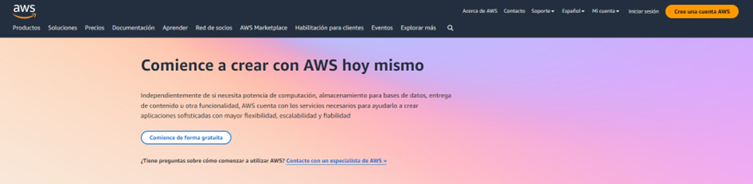

Tras darle a este botón, se tendrá que llenar una serie de pasos basados en llenar diferentes formularios para poder crear y configurar la cuenta. En el primero de estos pasos, se deberá ingresar el correo electrónico y nombre para la cuenta. Tras llenarlo se deberá verificar el correo electrónico ingresado, para lo cual se requerirá ingresar un código enviado a este mismo. 

### Figura 3.1.2
Formulario de correo y usuario

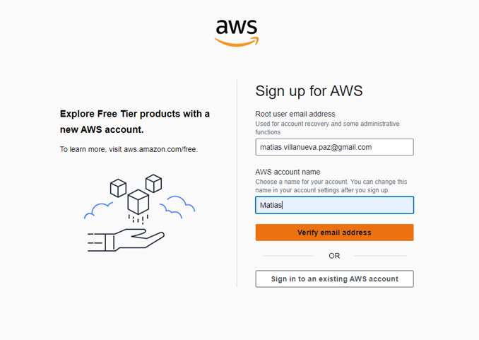

Tras realizar la verificación del correo, se presentará un formulario para crear la contraseña. Es importante tener en cuenta los diferentes requisitos que pide Amazon para crear una contraseña robusta. Posterior a este paso se deberá completar un formulario con la información personal del usuario. 

### Figura 3.1.3
Formulario de información de contacto.

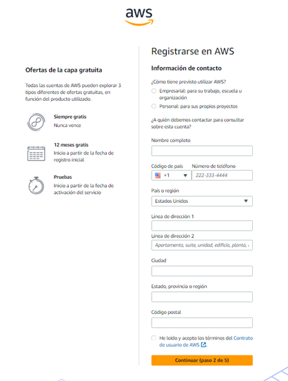

Amazon requerirá que se ingrese un método de pago para la creación de la cuenta, pero es importante resaltar que no es necesario realizar ningún pago para cuestiones de esta demo debido a que los servicios utilizados se van a encontrar por debajo de los limites gratuitos de AWS. Solo se realizará un pequeño cobro de hasta 1 dólar para verificar la veracidad del método de pago ingresado. Una vez se ha confirmado el método de pago, se tendrá que hacer una verificación mediante número telefónico y captcha para verificar la identidad. 

### Figura 3.1.4
Verificación de identidad

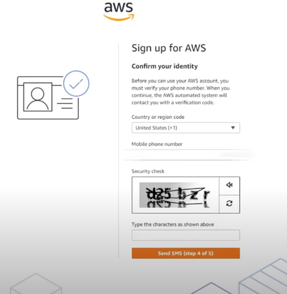

El paso final para la configuración de AWS es seleccionar el plan que se desea adquirir para la cuenta. Este cuenta con tres tipos de planes, dos de pago y uno gratuito. Para este caso nos limitaremos a elegir el plan básico, el cual no cuenta con costo alguno. Finalmente se mostrará un mensaje de bienvenida y se podrán utilizar los diferentes servicios que ofrece AWS.

### Figura 3.1.5
Selección de plan

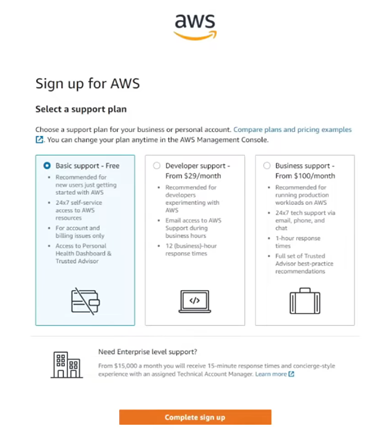

### 3.2. Primeros pasos

Cuando uno inicia sesión en AWS, se le presenta una consola, la consta de una interfaz gráfica basada que permite a los usuarios gestionar y operar sus servicios de AWS. Por ejemplo, facilita el lanzamiento y configuración de servicios como EC2, RDS o Amazon S3. Además de ofrecer herramientas para monitorear el rendimiento y uso de estos servicios, permitiendo recibir alertas y notificaciones sobre posibles problemas, así como realizar tareas de mantenimiento.

### Figura 3.2.1
Consola de AWS

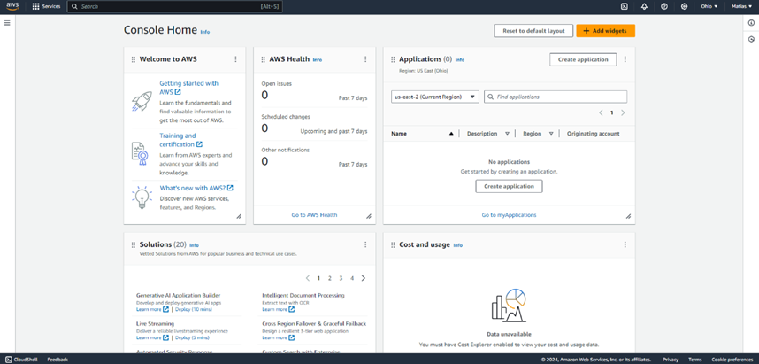

Para poder acceder a los diferentes servicios que ofrece Amazon, se puede utilizar la barra de búsqueda ubicada en la esquina superior izquierda. En esta se debe ingresar el nombre del servicio requerido y se desplegara una lista con diferentes opciones. Por ejemplo, se puede buscar el servicio se Cloud Storage llamado S3 y poder configurarlo al gusto del usuario.

### Figura 3.2.2
Búsqueda de servicios 

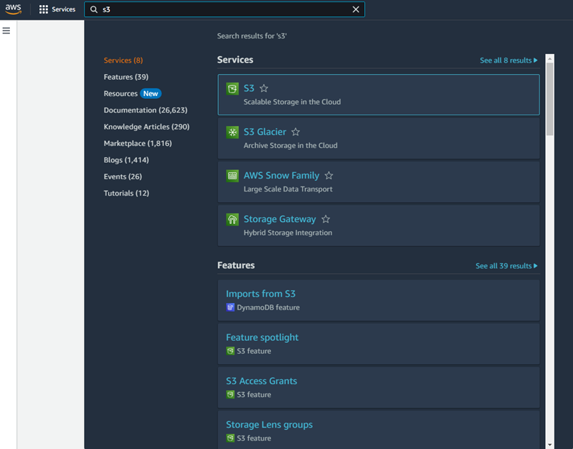

## 4. Demo

### 4.1. Escenario práctico

José, propietario de Itsec Games, un sitio web de juegos en línea, está preocupado por la seguridad de su plataforma. Reconoce la importancia de proteger los datos de sus usuarios y la integridad de su sitio web. Para garantizar la seguridad de su plataforma, decide contratar a un hacker ético para realizar un escaneo a la página web y verificar la seguridad de esta. El objetivo principal de esta evaluación de seguridad es identificar y mitigar posibles vulnerabilidades en el sitio web itsecgames.com y el servidor en el que se está alojando. Esto incluye la identificación de puertos abiertos, la evaluación de vulnerabilidades de la página web y facilidad de identificar las conexiones e información del servidor. En caso se identifique una vulnerabilidad, José ha cedido el permiso para poder explotarla y ver como es que se comporta la página frente a esta.

### 4.2. Pasos para la demo

En primer lugar, es necesario poder obtener la dirección IP del servidor en el que esta hosteada la web, para lo cual se utilizara la pagina whatweb, la cual se encargara de brindarnos la información necesaria.

### Figura 4.2.1
Información de dirección objetivo

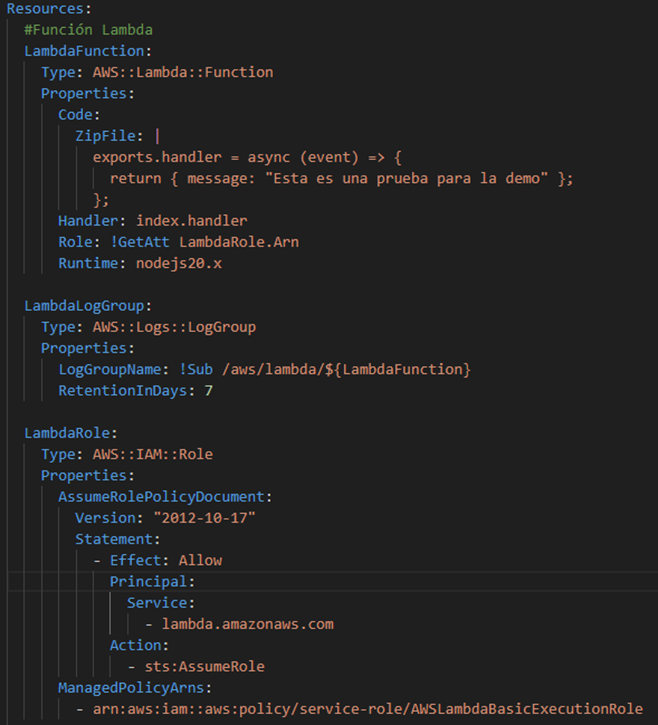

Teniendo esta información, se puede utilizar Nmap para realizar la penetración. Es necesario abrir la consola para verificar que se cuente con el programa instalado correctamente. Para esto se debe ingresar el comando nmap y esperar a que se despliegue la información de comandos que presenta el sistema para poder verificar que este instalado correctamente. Tras esto, se procede a realizar el primer escaneo enfocado a identificar cuales son los puertos que se encuentran abiertos en la red objetivo. Para esto se emplea el comando nmap -sT 31.3.96.40. En este caso el resultado nos dice que los puertos que estan abiertos son el 22, 80 y 443.

### Figura 4.2.2
Escaneo simple de puertos

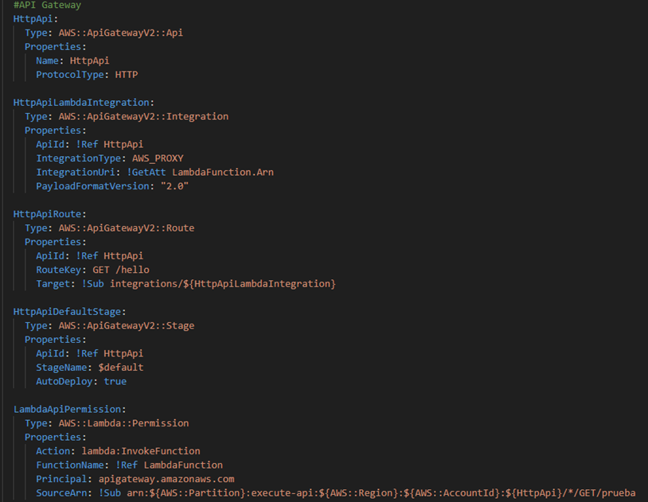

Para la identificación de los puertos, también se puede realizar un escaneo de tipo forzado. Para este se utiliza el comando nmap -sS. Adicional a esto, se puede realizar un pin a las diferentes IP que se encuentran conectadas a la red, lo cual nos otorgara información más sensible sobre el objetivo. En este caso, dado que se han identificado puertos abiertos, se seleccionarán los puertos que se desean escanear con el comando -p, siendo el comando final nmap -sS -p 80,443 31.3.96.0/24.

### Figura 4.2.3
Escaneo forzado a las IP de la red

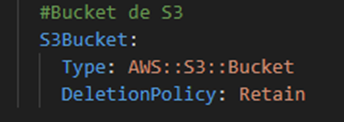

Contando con esta información, lo que se procederá a hacer es utilizar una de las direcciones IP conectadas a la red como un decoy, adicionando el comando -D seguido de la dirección señuelo. Este paso se realiza con la finalidad de esconder la IP de la máquina origen que está realizando la exploración. El comando final para esta acción es el siguiente, nmap -sS -D 31.3.96.177 -p 80,443 31.3.96.0/24. A este también se le puede adicionar un método para predecir el sistema operativo en el cual se esta alojando el servidor, adicionado -O previa a la ip objetivo seleccionada, nmap -sS -D 31.3.96.177 -p 80,443 -O 31.3.96.205.

### Figura 4.2.4
Predicción de sistema operativo

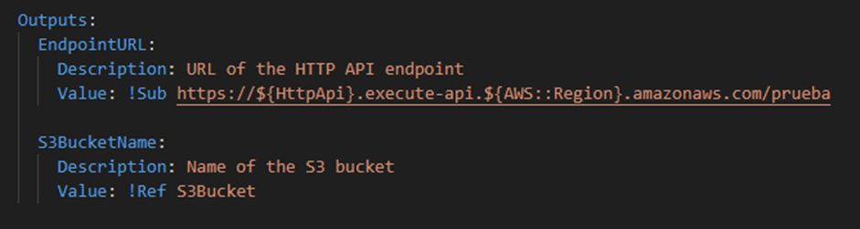

Para finalizar con la penetración, se procederá a identificar las vulnerabilidades de seguridad con las que cuenta la página web. Nmap cuenta con una gran variedad de scripts para revisar si es que el objetivo cuenta con vulnerabilidades específicas. Sin embargo, también se presenta la posibilidad de ejecutar todos los scripts secuencialmente y obtener un reporte de que vulnerabilidades se han identificado. Par esto se procederá a adicionar el comando --script vuln, donde el comando final será el siguiente, nmap -sS -D 31.3.96.177 --script vuln 31.3.96.205.

### Figura 4.2.5
Identificación de vulnerabilidades

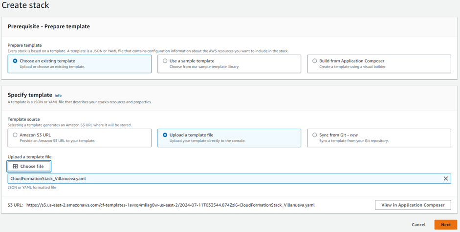

Dado que la pagina utilizada principalmente está elaborada específicamente para el test de penetraciones, mas no para el test de vulnerabilidades, para la parte de explotar una vulnerabilidad se va a emplear la página web https://pentest-ground.com:4280/. Para esta demo se va a brindar un ejemplo de como realizar un ataque Cross Site Scripting (XSS). Este tipo de ataques se caracterizan por la inyección de código aprovechando una vulnerabilidad de seguridad dentro de una pagina web. Para el primer caso se va a realizar un ataque XSS reflejado, el cual se limita a incrustar el código malicioso en una URL. Para esto, se empleará un script simple recuperado del siguiente repositorio de Github, https://github.com/swisskyrepo/PayloadsAllTheThings. Al identificar que la pagina objetivo presenta una barra de texto la cual nos redirige o realiza una acción cuando se rellena, se puede realizar este tipo de ataques. Para este caso se utilizará el siguiente script:
< script>alert('Prueba Demo XSS')</ script>
Al ejecutarlo se podrá observar la caja de alerta y se cargará una nueva URL con el script inyectado:
https://pentest-ground.com:4280/vulnerabilities/xss_r/?name=%3Cscript%3Ealert%28%27Prueba+Demo+XSS%27%29%3C%2Fscript%3E#

### Figura 4.2.6
Ataque XSS reflejado

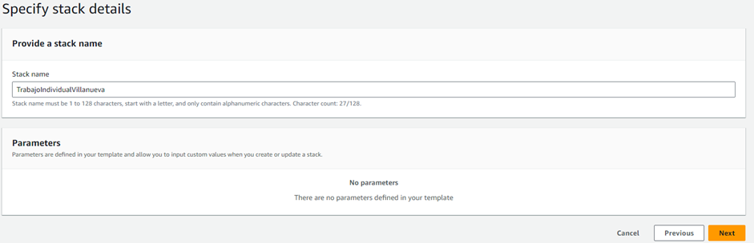

En el segundo caso, se va a realizar un ataque XSS almacenado. Este se encarga de almacenar el código malicioso en la base de datos del objetivo, haciendo que cada vez que un usuario ingresa a la pagina web, el script se ejecute de manera automática. Para esto, se va a utilizar el script previo. En este caso, se puede identificar que la alerta se ejecuta en el enlace original, y cada vez que el usuario recargue la página seguirá saliendo hasta que se haga un reset a la base de datos.

### Figura 4.2.7
Ataque XSS almacenado

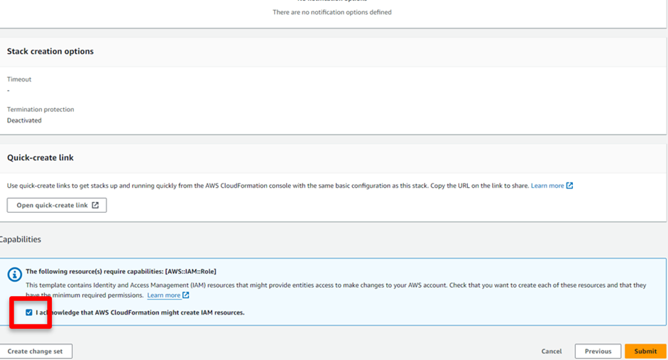

### 4.3. Resultados

Tras la penetración y la simulación de explotar una vulnerabilidad, se ha identificado de la página web de Itsec Games no esta lo suficientemente protegida. Esto debido a la facilidad con la que se pudo acceder y realizar los escaneos requeridos por el dueño. Se pudieron identificar correctamente los puertos que se encontraban abiertos, las diferentes direcciones IP que se encontraban en la red y una amplia lista de vulnerabilidades presentes en su página. En lo que respecta a realizar un ataque, los dos tipos de XSS efectuados se dieron con éxito, permitiendo inyectar scripts en la base de datos y una URL adicional que puede ser empleada para atacar a los usuarios de Itsec Games. 

## 5. Referencias

- Farsole, A. A., Kashikar, A. G., & Zunzunwala, A. (2010). Ethical Hacking. International journal of computer applications, 1(10), 14-20. https://doi.org/10.5120/229-380

- OWASP. (2020). Penetration Testing Methodologies. https://owasp.org/www-project-web-security-testing-guide/stable/3-The_OWASP_Testing_Framework/1-Penetration_Testing_Methodologies

- Palmer, C. C. (2001). Ethical hacking. IBM systems journal, 40(3), 769-780. https://doi.org/10.1147/sj.403.0769

- Sahare, B., Naik, A., & Khandey, S. (2014). Study of ethical hacking. Computer Science, 6-10.

- Ushmani, A. (2018). Ethical Hacking. International Journal of Information Technology, 4(6), 1-4.

