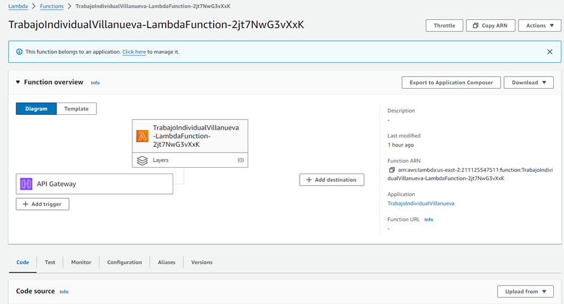

# **Tópicos en Arquitectura de Software**

## 1. Tema

Para el siguiente componente individual del trabajo, se abordará el tema de Infraestructura como código, el cual pertenece a la categoría de Servicios en la nube.

## 2. Desarrollo Conceptual

Según Ijlal (2020), la Infraestructura como Código (IaC) es la práctica de gestionar y desplegar infraestructura a través de archivos de código en lugar de procesos manuales. Esto significa que se pueden desplegar servidores, bases de datos y redes utilizando líneas de código, lo cual se conoce como "plantillas" que un servicio lee y se encarga de generar lo que se le ha especificado. Este enfoque no solo ayuda con la minimización de errores al momento de desplegar una infraestructura especifica, sino que también asegura la consistencia al crear entornos idénticos cada vez que se despliega la infraestructura (Ijlal, 2020).

La IaC es utilizada comúnmente para automatizar la creación y gestión de entornos de desarrollo, pruebas y producción. De este modo se facilita la escalabilidad, repetibilidad y consistencia de la infraestructura, además de lograr reducir errores humanos y facilitar la configuración de la infraestructura requerrida. Estos beneficios mejoran la eficiencia operativa y fomentan una colaboración más estrecha entre los equipos de desarrollo y operaciones. La IaC también permite una infraestructura más ágil y adaptable a cambios, crucial en entornos de desarrollo e integración continuos.

Entre las herramientas más populares para IaC se encuentran:

- Terraform: Desarrollado por HashiCorp, permite definir infraestructura en un archivo de configuración y desplegarlo en múltiples proveedores de servicios en la nube.

- AWS CloudFormation: Proporciona una manera de modelar y configurar los recursos de AWS para aplicaciones.

- Utiliza un enfoque simple basado en YAML para automatizar la configuración, el despliegue y la gestión de sistemas.

- Facilita la gestión de la configuración y automatización del aprovisionamiento de servidores.

- Proporciona una forma de automatizar la infraestructura mediante scripts de configuración que se pueden versionar y compartir.

## 3. Consideraciones Técnicas

### 3.1. Instalación / Configuración de Servicio

Uno de los servicios que permite desarrollar una Infraestructura como código es Amazon Cloud Formation, perteneciente a Amazon Web Services. Por esta razón, para poder emplear esta tecnología, es necesario contar con una cuenta de AWS. Desde el siguiente enlace se puede iniciar este proceso, https://aws.amazon.com/es/. Para lo cual se le debe dar al botón de “Crear una cuenta AWS” en la esquina superior derecha.

### Figura 3.1.1
Creación de cuenta de AWS.

Tras darle a este botón, se tendrá que llenar una serie de pasos basados en llenar diferentes formularios para poder crear y configurar la cuenta. En el primero de estos pasos, se deberá ingresar el correo electrónico y nombre para la cuenta. Tras llenarlo se deberá verificar el correo electrónico ingresado, para lo cual se requerirá ingresar un código enviado a este mismo. 

### Figura 3.1.2
Formulario de correo y usuario

Tras realizar la verificación del correo, se presentará un formulario para crear la contraseña. Es importante tener en cuenta los diferentes requisitos que pide Amazon para crear una contraseña robusta. Posterior a este paso se deberá completar un formulario con la información personal del usuario. 

### Figura 3.1.3
Formulario de información de contacto.

Amazon requerirá que se ingrese un método de pago para la creación de la cuenta, pero es importante resaltar que no es necesario realizar ningún pago para cuestiones de esta demo debido a que los servicios utilizados se van a encontrar por debajo de los limites gratuitos de AWS. Solo se realizará un pequeño cobro de hasta 1 dólar para verificar la veracidad del método de pago ingresado. Una vez se ha confirmado el método de pago, se tendrá que hacer una verificación mediante número telefónico y captcha para verificar la identidad. 

### Figura 3.1.4
Verificación de identidad

El paso final para la configuración de AWS es seleccionar el plan que se desea adquirir para la cuenta. Este cuenta con tres tipos de planes, dos de pago y uno gratuito. Para este caso nos limitaremos a elegir el plan básico, el cual no cuenta con costo alguno. Finalmente se mostrará un mensaje de bienvenida y se podrán utilizar los diferentes servicios que ofrece AWS.

### Figura 3.1.5
Selección de plan

### 3.2. Primeros pasos

Cuando uno inicia sesión en AWS, se le presenta una consola, la consta de una interfaz gráfica basada que permite a los usuarios gestionar y operar sus servicios de AWS. Por ejemplo, facilita el lanzamiento y configuración de servicios como EC2, RDS o Amazon S3. Además de ofrecer herramientas para monitorear el rendimiento y uso de estos servicios, permitiendo recibir alertas y notificaciones sobre posibles problemas, así como realizar tareas de mantenimiento.

### Figura 3.2.1
Consola de AWS

Para poder acceder a los diferentes servicios que ofrece Amazon, se puede utilizar la barra de búsqueda ubicada en la esquina superior izquierda. En esta se debe ingresar el nombre del servicio requerido y se desplegara una lista con diferentes opciones. Por ejemplo, se puede buscar el servicio se Cloud Storage llamado S3 y poder configurarlo al gusto del usuario.

### Figura 3.2.2
Búsqueda de servicios 

## 4. Demo

### 4.1. Escenario práctico

Ana, gerente de una empresa de análisis de datos llamada DataInsights, está buscando una solución para exponer sus servicios de análisis de datos a sus clientes. Se ha establecido como objetivo desplegar una infraestructura en la nube base, que permita a los clientes acceder a los servicios de análisis de datos de DataInsights mediante una API, sin necesidad de gestionar servidores o infraestructura adicional. Esto incluye la creación de una función Lambda que procese las solicitudes de análisis, un bucket de S3 para almacenar datos de entrada y salida, y un API Gateway que actúe como un frontend para las solicitudes HTTP.

### 4.2. Pasos para la demo

Para poder llevar a cabo la infraestructura como código, primero es necesario realizar un diagrama que represente los servicios que se van a integrar en la plantilla. Para el diseño de este diagrame se están empleando los lineamientos establecidos por AWS.

Para poder crear un Stack en Cloud Formation, es necesario contar con una plantilla la cual cuente con los diferentes servicios que se desean crear a partir del formato establecido por Amazon. En este caso se utilizará una plantilla en .yaml, la cual se explicara a continuación.
La versión estándar que se debe emplear es la "2010-09-09" y el apartado de Resources es el único obligatorio para poder subir la plantilla Cloud Formation. El primer servicio por instanciar va a ser una función Lambda encargada de retornar un mensaje. En el recurso LambdaFunction se está asignando una función Lambda, servicio que permite poder ejecutar código de forma serverless. LambdaLogGroup consta en la creación de un grupo de logs en CloudWatch Logs para almacenar los logs de la función Lambda. Mientras que con LambdaRole se está asignado un rol IAM asumido por la función, proporcionando los permisos básicos necesarios para controlar qué acciones puede realizar y a qué recursos puede acceder.

### Figura 4.2.1
Creación de función Lambda

En segundo lugar, tenemos la creación de una API Gateway. Esta tiene como función proporcionar un endpoint, lo cual permite invocar la función Lambda a través de una solicitud. En el bloque de código HttpApi, se está estableciendo que el servicio a utilizar es API Gateway con el protocolo HTTP. En HttpApiLambdaIntegration se esta especificando que se desea crear una integración para a API. También es necesario obtener el ARN de la función Lambda. Con esto se está indicando a API la función Lambda a la que debe enviar las solicitudes. Con el HttpApiRoute se esta creando una ruta en el API Gateway, especificando que esta responderá a solicitudes HTTP GET en el endpoint. Por último, en LambdaApiPermission se están asignando los permisos necesarios al API Gateway para poder invocar la función Lambda. 

### Figura 4.2.2
Creación de función HTTP Gateway

En tercer lugar, S3Bucket esta especificando la creación de un Bucket de S3. Adicionalmente, en el campo “DeletionPolicy: Retain” se está especificando que el bucket no debe eliminarse en caso el usuario decida eliminar el Stack creado. Cabe resaltar que debido a que los Buckets S3 requiere de un nombre único, no es necesario especificar un nombre en la plantilla, AWS se encargara de generar uno que no se este utilizando. 

### Figura 4.2.3
Creación de Bucket S3

Finalmente, EndpointURL se utiliza para proporcionar la URL del endpoint de la API creada.

### Figura 4.2.4
Outputs

Una vez se ha completado la plantilla, se pasará a crear el Stack en Cloud Formation. Para esto se debe acceder a la opción de crear un nuevo Stack en el servicio ofrecido por AWS. Se deben marcar las casillas “Chose an existing template” y “Upload a template file”, esto con la finalidad de subir la plantilla que se ha desarrollado previamente. Tras completar estos campos se procederá a darle clic al botón next.

### Figura 4.2.5
Creación de Stack

Tras esto se pedirá ingresar un nombre para la nueva pila. 

### Figura 4.2.6
Asignación de nombre para el Stack

Despues de asignar el nombre, se deberá dar al botón de next hasta encontrar el cuadro celeste con signo de explicación. En este se deberá marcar el check del mensaje y por último darle al botón con el texto de “Submit”.

### Figura 4.2.7
Confirmación 

Tras estos pasos, ya se tendrá el Stack creado con todos los servicios establecidos en la plantilla .yaml. 

### Figura 4.2.8
Lista de recursos

Una vez tenemos desplegada la lista de los recursos, el usuario puede acceder a estos para visualizarlos y configurarlos a su gusto. En la siguiente imagen se podrá observar como ejemplo la vista que se despliega al seleccionar la función Lambda.

### Figura 4.2.9
Recurso Lambda

De igual forma se puede acceder a los outputs creados en la platilla. En este caso se puede acceder al endponit establecido para correr la función Lambda. 

### Figura 4.2.10
Outputs

Como se puede observar en la siguiente imagen, al acceder a la URL del endpoint, se nos redirige al mensaje establecido en la función Lambda.

### Figura 4.2.11
Outputs

### 4.3. Resultados

Tras la ejecución de la plantilla en CloudFormation, se ha desplegado con éxito una API HTTP integrada con una función Lambda, junto con un bucket de S3. La API Gateway está configurada para invocar la función Lambda mediante una solicitud HTTP GET /prueba, lo que permite a los clientes recibir un mensaje desde Lambda. Además, se ha creado un grupo de logs en CloudWatch para monitorizar las ejecuciones de Lambda y un rol IAM que proporciona los permisos necesarios para su funcionamiento. El bucket de S3 se ha creado con una política de retención, garantizando que los datos almacenados no se eliminarán accidentalmente. Los outputs generados incluyen la URL del endpoint de la API y el nombre del bucket de S3, facilitando el acceso y la gestión de los recursos desplegados.

## 5. Referencias

- Fowler, M. (2016). Infrastructure As Code. martinfowler.com. https://martinfowler.com/bliki/InfrastructureAsCode.html

- Ijlal, T. (2020). Securing and Embracing Infrastructure as Code. isaca. https://www.isaca.org/resources/isaca-journal/issues/2020/volume-4/securing-and-embracing-infrastructure-as-code